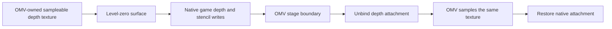

# OMV depth transport independent of DXVK vendor profiles

## Immutable capture caches and exact sampler restoration

The production snapshot service retains four immutable surface descriptions:
world/first-person depth and their paired color surfaces. Each entry owns a
COM surface reference, so a raw address cannot be recycled while its proof is
cached. Native current-source discovery, camera, Z function, image domain,
semantic stage and render epoch are still validated on every resolve. Only
resource descriptions, texture-container ownership and the exact level-zero
surface check are reused. Cached data never includes pixels or freshness.

The render attachment journal still queries every actual bound attachment.
Each destination slot caches one successful R32F/depth compatibility proof
against its retained bound surface and exact target width/height/format.
An attachment or target-domain change reruns the complete driver validation;
failed admission retains the detach/rebind fallback and is not cached. Reset,
provider release and device replacement drop descriptors, container ownership,
compatibility proofs and targets. Descriptor-query contention falls back to
the original query; capture contention publishes no texture. All new mutable
storage lives inside the existing post-Deferred boxed service, preserving the
loader-visible static slot and preparation timing.

The bounded depth journal unbinds only samplers whose captured binding was
occupied, including vertex samplers when supported. All occupied bindings are
still inspected and restored. Sampler zero must restore its captured value
even when empty because the snapshot draw binds the depth input there. The
previous empty-binding shortcut leaked the sampled depth at s0; a real HAL
capture regression failed on that exact boundary before the correction.
Attachment restoration remains first and draw-state restoration last, also
after a partially failed draw. COM retirement during release runs outside the
service lock.

The warm-capture regression measures real executed calls: one descriptor,
container, level-zero and depth-compatibility validation, plus 20 empty
sampler clears, became zero for the same warmed resources with empty samplers.
An intervening native clear changes the captured pixels despite the cached
metadata. Additional actual-resource executions cover source replacement,
allocation/image-size changes and cache release; existing raw-depth, stencil,
terrain, first-person and attachment regressions continue to own pixel and
state acceptance. Snapshot shader work remains one point sample and one draw
into full-precision R32F. No capture stage, depth precision, resolution or
consumer was removed. This is an offline work reduction, not an FPS claim.

## Requirement and conclusion

OMV must obtain current pre-alpha, coherent-world, and first-person depth
without asking users to pin DXVK, spoof a vendor, edit `dxvk.conf`, or install
Depth Resolve. The owner explicitly accepts dropping native Fallout NV MSAA
in favor of OMV's AA. Retaining native MSAA is no longer an acceptance
requirement. This supersedes the configuration remedy
considered in [the NVIDIA investigation](graphics_fnv_driver_owned_d3d_nvidia_depth.md).

The ownership investigation below identifies an earlier intervention:
have the game render directly into an OMV-owned sampleable depth texture.
ReShade implements this for eligible single-sample D3D9 resources. The supplied
ENB wrapper also uses this architecture through temporary attachment
substitution, as established in the
[ENB binary audit](graphics_fnv_enb_depth_contract.md). This is
now the preferred architecture: compatible scene color and depth attachments
use single-sample rendering, and OMV owns the sampleable depth texture. It
removes the RESZ/NvAPI copy dependency without requiring DXVK interop. INTZ
is still a queried driver capability, not a core D3D9 guarantee. The native
contracts below support implementation, and the offline qualification section
records actual GPU results separately from unexecuted game integration.

OMV contains temporal AA and spatial FXAA, NFAA, AXAA, DLAA, and SMAA paths
in `omv/src/effects/temporal_aa.rs` and `anti_aliasing.rs`. Their existence does
not imply that AA is enabled in a user's configuration or that their output
is identical to native MSAA. This plan does not silently select an AA preset.
Selection of a depth backend must not use OS names, GPU names, DLL versions,
or DXVK configuration parsing.

The owned D3D9 transport and ordinary acquisition-policy correction are
implemented. The owner's save-load failures reject the former reset-driven
activation; the current implementation never requests that reset. Actual
multisampled presentation still needs the separate integration described below,
so complete configuration-independent coverage is not implemented. This section
supersedes reset-driven activation in the historical sections. The native audit
establishes allocation, attachment, clear continuity,
deferred frame ordering and shared reset boundaries. The continuation also
proves retained per-resource sample preferences and the separation between
requested reset and recovery. The integration audit below closes native
reference disposal, allocation initialization, shared first-person aliases,
and the callbacks needed to retire attachment ownership. The selected design
replaces eligible depth backing persistently while retaining native objects,
sample preferences and pool keys. `owned_depth.rs` and `depth_snapshot.rs`
implement this ownership; preference journals and forced-reset retries have
been removed.
A short-lived ENB-style attachment swap cannot preserve FNV's proven
zero-clear world rebind. The
Vulkan interop investigation below is retained as an alternative, not the
active implementation plan. Its explicit CPU synchronization conflict does
not apply to the proposed D3D9-only ownership path.

Literal compatibility with every historical, future, modified, or broken
DXVK cannot be established. The implementable objective is no version/config
policy dependency: use the live device's published interfaces and actual
resource capabilities, retain working legacy transports, and expose precise
failures when those contracts are absent. Unsupported arbitrary future
behavior must not be represented as tested compatibility.

## Depth image coordinates: larger backing and letterboxed presentation

Presentation UI has a separate ownership boundary from scene effects. With
the depth provider disabled, the final effect fallback runs at Present;
failure to read its native image rectangle must still allow the menu and PBR
preparation overlay to render. The effect error remains reportable. Before
either overlay, OMV detaches depth and auxiliary targets and explicitly binds
the swapchain backbuffer: Dear ImGui's DX9 backend sets its viewport and draw
state but inherits RT0. A cropped effect graph can leave its scratch target
bound after the rectangle copy. The surrounding Present transaction restores
native attachments and captured state even on failure or menu-driven resource
retirement. No additional UI target work runs when both overlays are absent.
Offline regressions execute the actual Present and ImGui paths, checking visible
backbuffer pixels with unavailable scene metadata and an offscreen attachment,
plus restoration of that attachment and viewport. Game integration is not run.

The owner's NVIDIA-only report is
[omv-latest-nvidia-only.log](../.reports/omv-latest-nvidia-only.log), with
[exterior](../.reports/broken_godrays.png) and
[interior](../.reports/broken_shadows.png) images from that session. The log
establishes three distinct extents in the same frame:

| Resource or phase | Recorded extent |
| --- | --- |
| Native depth allocation and OMV world snapshot | 1920x1200 |
| World color, atmosphere, TAA, scene-pre color | 1920x1080 |
| Scene-post color, DOF, final color and presentation | 1920x1200 |

The pre-alpha and coherent captures report the same source surface and a
world frustum of approximately `(-1.33333, 1.33333, -0.75, 0.75)`, near 5,
far 353840, and reversed depth. Shadow captures reject a valid color-camera
override with `invalid world camera projection override`. The current
`projection_matches_surface` compares that camera against the depth allocation
aspect. Meanwhile `depth_snapshot` copies the entire allocation and consumers
such as atmosphere reduction and composition use color UVs directly as depth
UVs. These are distinct, proven defects in admission and coordinate mapping.
The snapshot can contain valid raw depth while its consumers read the wrong
texels. Successful copy counters do not establish image correctness.

Larger depth backing is a valid
[D3D9 attachment contract](https://learn.microsoft.com/en-us/windows/win32/api/d3d9/nf-d3d9-idirect3ddevice9-setdepthstencilsurface).
Its unused extent must not be stretched into the color image. With the reported
extents, equal normalized V selects depth row `V * 1200` for color row
`V * 1080`. This explains the vertical displacement and bottom band mechanism;
it does not constitute a reproduced gameplay image or attribute grass coverage
and frame time to the same defect.

Post-image-space requires another mapping. The supported executable's native
`ImageSpaceShader::Render @ 0x00C03D80` selects the rectangle at `0x011AD840`
when its destination is null, letterboxing (`0x011F9426`) is enabled, and the
current group equals the default group (`0x00C03EE9..0x00C03F20`). It passes
that rectangle to renderer vtable `+0x190` before the image-space draw
(`0x00C03F25..0x00C03F89`). Intermediate main-target rendering instead selects
ImageSpaceManager `+0x308`. Existing authoritative evidence is
[the image-space contract](../analysis/ghidra/output/perf/graphics_fnv_image_space_pass_state_vtable_followup.txt),
section `ImageSpaceShader ImageSpaceEffect vtable[1]`; the direct binary
continuation is
[the coordinate audit](../analysis/ghidra/output/perf/graphics_fnv_depth_image_coordinates_radare2_audit.txt).
Do not substitute the presentation aspect or a hard-coded vertical scale for
either native rectangle. A world-only sampling correction leaves later DOF,
motion blur and other scene-post consumers incorrectly mapped.

The correction must give the common depth owner explicit allocation extent,
rendered color extent, native viewport, source/color identity, stage, epoch,
projection and depth convention. Each consumer needs a depth view in its own
color-image coordinates, with one shared texel-center mapping policy. Camera
admission must use the rendered color/projection contract. Cache identity must
include the mapping. External provider textures need their actual published
extent: the reference Depth Resolve allocates letterbox-sized depth, so native
backing dimensions are not an authoritative external texture size either.

Acceptance begins with the actual production resolver on a HAL D3D9 device
using the reported resource extents and camera. The
`world_depth_accepts_color_projection_with_larger_native_backing` regression
currently fails at the same projection rejection on unchanged production code.
This qualifies the failing admission path only. Before changing sampling,
exercise the shipped consumers with the proven resource/phase mapping and
check texel correspondence, both depth conventions, unused backing, letterbox
borders, and equal-size preservation. No cropped allocation-size assertion is
an image-correctness oracle. Implementation and offline qualification of the
coordinate correction remain outstanding.

The same report also bounds performance attribution. RESZ, NvAPI and external
copy counters remain zero; depth contention and retry counters remain zero.
Active interior intervals show two depth snapshots and three phase color
copies per frame. Intervals where those counters stop have much shorter
Present intervals, but there is no per-stage GPU timing or controlled
same-workload baseline. Local volumetric draws remain explicitly active with
directional lighting and fog disabled, consistent with their independent
configuration contract. Preserve that feature. The bind/clear owner still has
CPU validation work with screen effects off; its cost must be reduced only
after proving which checks belong to acquisition or attachment transitions.
Do not equate these observations with a measured FPS fix.

## Integrated correction plan

This plan covers the reported displaced player mask, fog band, volumetric
lighting artifacts, grass coverage, NVIDIA slowdown and unfinished black
terrain PBR correction. It preserves existing requested effects and the
reset-free depth acquisition work. Its starting evidence is the NVIDIA report
above and the [terrain input-owner investigation](graphics_fnv_pbr_errata.md#black-terrain-with-an-incomplete-constant-producer-2026-09-25).

| Track | Established defect or observation | Completion requirement |
| --- | --- | --- |
| Depth coordinates | Allocation extent is used as image extent; camera validation uses the wrong aspect | Every consumer samples depth corresponding to its color pixel and reconstructs with the matching projection |
| Image-space transition | World and post-image color have different extents and native viewport mappings | Preserve alignment through both intermediate and letterboxed default-target composition |
| Terrain PBR | Wrapper admission did not establish material/fog/light producers; the candidate also corrected a geometry-pass layout mismatch | Complete the native input owner and qualify close, fade, LOD and object transitions |
| Grass | Owner observes incorrect opacity; the failing material/state path is not yet proven | Preserve alpha-tested/coverage-dependent foliage in single-sample rendering without changing unrelated transparent draws |
| NVIDIA performance | Extra work exists in attachment hooks; active intervals include depth/color copies and independent local lighting | Eliminate proven redundant work and qualify deterministic costs without claiming an unmeasured FPS recovery |
| Toggle behavior | Local lighting is independent; effect-off retains native attachment obligations | Zero optional work for disabled consumers while already-owned attachments remain valid for native rendering |

### 1. Finish the terrain input owner

Preserve the existing candidate and follow the owning PBR errata's completion
work. Audit `terrain_inputs.rs`, `terrain_lights.rs`, `engine_contracts.rs` and
`hooks.rs` together: per-geometry admission, native producer ABI, publication,
supplemental exclusion, restoration and re-arming are one transaction.

Do not read terrain constants after an input capture has already failed.
Distinguish missing native input, failed device upload and failed restoration;
use the existing bounded failure reporting. Preserve family-specific material
semantics, full fog parameters, native light order including black entries,
0/6/12/24 capacities, companion variants, and object c32/c33 ownership.
Keep the real-D3D9 terrain/depth transaction regression. Check reset, shader
package replacement and repeated live toggles using executable portions where
available and the proven native lifecycle for game-only portions.

### 2. Establish one depth image/view contract

Refactor the common backend boundary, not individual effects' visual tuning.
An immutable capture describes actual source texture extent/format, rendered
color extent and identity, raster viewport and depth range, source surface,
stage, epoch, projection, precision and depth convention. Preserve independent
world and first-person captures. A consumer view adds its color-space rectangle
and the mapping to both sampled depth texels and camera projection coordinates.
Those two coordinate mappings are distinct.

Close remaining native details before adding field reads: exact integer
viewport conversion at renderer vtable `+0x190`, main-target versus default
group selection, first-person source ownership and any rectangle restoration
before the scene-post callback. Reuse the proven `0x00C03D80` selection and
existing group ownership; do not read an arbitrary currently bound attachment
as proof of an explicit rendered texture's extent.

Validate camera aspect against the rendered projection/color domain. Validate
resource compatibility separately: larger native backing is legal. Include
source extent, active region and consumer mapping in cache/history identities.
Read external providers' actual texture extent rather than demanding equality
with native backing. Keep device/reset/provider generations authoritative and
reject incomplete publication without exposing previous-frame data as current.

Prefer one shared CPU/HLSL sampling contract for OMV-owned shaders, with mapping
constants bound by the common depth view. Sampling must return or retain the
actual sampled texel center for reconstruction. Centralize raw-depth validity,
clear endpoints, standard/reversed convention and source precision. Preserve
each effect's intentional use of view-Z, ray distance or encoded history;
these quantities must remain explicitly named rather than being conflated.

Do not introduce a full-size normalization copy for each effect. Preserve the
external screen-shader sampler ABI: if an existing shader cannot consume view
metadata, provide its aligned texture through one backend-owned, demand-driven
compatibility view, shared by identical phase/stage requests. Its required
copy and memory costs must be explicit. Do not silently change existing
constant-register meanings or let each effect invent its own crop.

### 3. Migrate every depth consumer and its history

Apply the common view to atmosphere reduction/composition, directional and
local volumetrics, AO extraction/temporal/composition, shadow receivers and
contact shadows, TAA and its depth key, DOF focus/CoC, motion blur and depth
history, Sunshafts, first-person masks used by bloom, and the bundled runtime
depth-aware CAS shader. Include external screen-pass bindings. Reduced-depth
and history images describe their own domains, not the allocation extent of
the original native depth buffer.

Native image-space transition mapping must be captured once and shared by
scene-post/final consumers. Preserve letterbox borders, first-person/world
separation, jittered versus output cameras and existing effect order. Update
reprojection/history invalidation for viewport, extent and mapping changes.
Map projected sun/other screen-space coordinates when their consumer changes
image domain. Do not compensate with fog density, shadow bias, blur radius,
UV clamps or a resolution-specific vertical scale.

First keep the already-failing production resolver regression. Add failing
pixel regressions through the affected shipped HLSL and production bindings
using the report's proven resource and native phase contracts. Cover the
1920x1080/1920x1200 case, equal-sized preservation, nonzero native viewport,
both depth conventions, clear/unused regions, first-person composition, odd
sizes and actual supported reduction tiers. Assert pixel correspondence and
finite output, not a preferred texture allocation size. Existing temporal and
border oracles remain mandatory. An unrecorded gameplay scene is not replaced
with a synthetic character silhouette.

### 4. Close and repair grass coverage

The initial laptop presentation already reports MSAA=0 before OMV's acquisition
policy activates; that fact does not establish the grass draw's sample or
coverage state. Audit the actual grass shader/material path, alpha test
reference/comparison, alpha blending, vendor coverage enable/disable and the
native state cache across the current hooks. Inspect affected assets and
shipped/native shader bytecode before selecting a coverage equation.

Native `0x00B98540` writes NVIDIA ATOC or AMD A2M vendor states. Establish its
complete relevant grass callers and their pairing with material alpha tests;
an enabled extension alone does not prove correct single-sample coverage.
If the defect is state leakage, repair the owning transaction. If the proven
material relies on multisample coverage, supply an OMV-owned single-sample
coverage implementation at that material's native draw boundary, preserving
alpha semantics and the relationship between color and depth rejection.
Choose deterministic cutout, blending or temporal coverage only from the
proven material contract and quality acceptance; do not guess an alpha cutoff
or impose one across all foliage. Restore state through the native cache-aware
boundary, preserving unrelated blending and UI draws.

Use the affected shader/material inputs to fail an offline color-and-depth
coverage test before production changes wherever executable. Qualify thin
blades, partial alpha, overlapping layers, distance/mips, motion and existing
AA combinations. Standard single-sample rendering remains the accepted policy;
silently restoring native MSAA or deleting foliage coverage is not this fix.

### 5. Reduce measured and statically proven work

Start from the actual production attachment and effect paths. Separate setup,
resource transition, steady-state frame and effect-off costs. Compare D3D
calls, state captures, bytes/pixels copied, allocations, locks, native memory
validation and shader work; use executable production benchmarks when those
paths are available offline. Existing log intervals are supporting evidence,
not per-stage GPU timings or a controlled FPS benchmark.

For `owned_depth::bind`, move immutable descriptor/capability validation to
acquisition or a proven attachment-change boundary. Cache compatibility by
actual color/depth identity and generation, including all MRTs, dimensions,
format and sample state. Prove mutation and retirement coverage first; a
same-pointer or once-per-frame cache alone is insufficient. Remove the second
registry update once the first-bind rollback obligation is retired. For
`clear_buffer`, avoid repeating admission work on known owned backing and
reject irrelevant clears before expensive validation, only where caller
lifetime proof makes the reads safe.

Separate optional adoption/capture demand from mandatory maintenance of
already-owned native resources. Effect-off cannot simply bypass ownership,
release a surface still used by native rendering, or suppress a valid native
bind on a bookkeeping miss. Preserve the main/loading renderer serialization,
reference ownership, first-bind rollback and reset failure containment.

Build depth/color demand from actual ready consumers and semantic stages.
Skip capture, reduction, copies, histories and local-light traversal when no
consumer needs them. Coalesce identical view requests. Retain physically
distinct pre-alpha/coherent/first-person versions where intervening writes
require them. Consider a borrowed pre-alpha INTZ view only after proving its
entire synchronous consumption lifetime and absence of target feedback; never
remove a snapshot merely because the source identity is unchanged.

Preserve independent directional/local lighting toggles and quality. Make
diagnostics name directional and local activity separately so `lighting=false`
does not imply all lighting is idle. Verify that each disabled family and the
global switch perform zero optional GPU work. Do not relabel disabling local
lights, lowering quality or reducing supported effects as a performance fix.

### Implemented source-image and attachment contracts

The owned INTZ transport now publishes the paired native color image, rather
than its possibly larger depth allocation. `depth_snapshot::capture` accepts
the color extent explicitly, validates containment, allocates an R32F image of
that extent and maps each output pixel to the same integer attachment pixel.
It preserves the existing point sample, half-pixel convention, raw depth
values, two semantic slots and attachment/state restoration transaction.
The cropped snapshot replaces the previous snapshot; it adds no pass on the
owned route. Equal-sized captures retain their original mapping. Legacy
RESZ/NvAPI copies use this same crop when backing is larger; this case requires
one additional snapshot after the legacy physical copy. Equal-sized aliases
retain their existing route.

`DepthImageFrame` separates native color identity/extent, depth allocation
extent and the actual sampled extent. Exact capture-cache matching includes
this domain. Temporal admission validates the color domain independently of
the larger native backing. A legacy cropped copy retains its last successful
image domain with the persistent copy target, allowing next-epoch temporal
preparation without treating expired pixels as current.

The executable GPU regression uses the reported 1920x1080 color and
1920x1200 depth contract. It writes the final 60 color rows through D3D9 depth
clears and observes the actual production snapshot at consumer image UVs. The
unchanged allocation-based transport reads those rows beginning at color row
918 instead of 1020. The corrected transport preserves every tested color-row
value. This proves the source-publication boundary, not post-image-space
letterboxing, projection reconstruction or the reported gameplay images.

The attachment binder retains the two most recent successfully validated MRT
sets for each adopted depth identity. A cache containing only the current set
repeats descriptor and capability discovery on every A/B target alternation.
The capability helper includes GetCreationParameters, GetDirect3D,
GetAdapterDisplayMode and CheckDepthStencilMatch; it is not a local format
comparison. The real-device alternating-target regression previously issued
128 capability queries for 128 binds of two resources; bounded retention issues
two. Eviction requires full validation again. This is an API-work reduction,
not evidence of the reported gameplay FPS loss's cause or recovery.

Retained identities skip descriptor and format-compatibility queries, and
steady-state binds skip the second registry update after the initial backup
has retired. COM retention prevents an address-reuse cache hit; replacement
owners retire outside the registry lock. The cache retains at most eight
surface references per depth identity (two sets of four); it can extend those
color resources' lifetime until eviction or native depth release/reset and
does not allocate GPU copies. Validation is tied to that depth generation,
not a global format or unretained pointer cache. Actual MRT identities are still
queried at binding. Bind/release/reset hooks continue maintaining adopted
native resources independently of the master switch.

### Provider readiness and live effect changes

Backing preparation follows deferred device capability admission, independent
of provider selection, the master switch and the currently enabled consumers.
Only the selected OMV provider changes future native MSAA acquisition policy.
Creation, recreation and a complete depth/stencil clear are safe
replacement opportunities; enabling an effect later is not. Gating those
opportunities on effect demand can leave a populated shared native surface
without sampleable backing. Neither a partial world clear nor a depth-only
first-person clear authorizes replacing that surface.

The owner-supplied
[depth performance log](../.reports/omv-latest-depth-performance.log) starts
with OMV selected and the master disabled. After enabling the master, the
legacy fallback is unavailable and all capture counters remain zero until the
first successful interior capture. This proves missing usable depth during
that interval. It does not identify the failing source's format/sample count
or prove that every unavailable source missed a master-gated clear. Preparing
at eligible boundaries independently of effect demand corrects the lifecycle
hole without weakening coverage or requesting a device reset. Existing
resources which never encounter a safe boundary remain unavailable; this is
not permission to replace their retained pixels.

The subsequent [broken-depth report](../.reports/omv-latest-broken-depth.log)
starts with provider `none`, then switches to OMV during gameplay. It records
unavailable RESZ/NvAPI and zero physical depth copies through 5,472 world
callbacks; the first full-clear adoption message is at the report's end. The
source gated both capability admission and backing adoption on OMV selection,
so earlier safe opportunities could not prepare backing. Admission now runs
once per device generation at the existing post-frame boundary, including
with depth disabled. Eligible existing single-sample backing is prepared at
the same creation/full-clear boundaries. This adds no reset, partial-clear
replacement, capture, shader draw, or pre-DeferredInit work. Once admitted,
disabled/external providers exit initialization before recurring D3D queries;
native policy changes retain their OMV-selection and parked-worker gates.

The native callback scheduling cannot execute offline. Existing real-device
tests cover the unchanged full-clear preparation, partial-clear rejection,
terrain state preservation and stable snapshot transport. They do not prove
the game's timing of those opportunities. This report also rules out physical
OMV depth copies as work performed during its failing interval: all copy
counters are zero. Per-frame hooks, scene inputs, local lights, custom shaders
and color processing remain separate costs; the report has no timings that
attribute the reported FPS loss among them. No FPS recovery is established.

Per-frame snapshots, color copies and effects still follow consumer demand.
The actual screen-source publication regression verifies no depth capture
request for an empty graph or color-only work, a request for DOF, and no request
with master-off. That boundary must not be confused with resource preparation.

Recurring owned clears perform native field reads and one nonblocking registry
lookup, then chain the original clear. They perform zero OMV memory-region
queries, COM calls, capability checks or allocation. Previously three
memory-region validations preceded the owned-identity lookup. For unowned
backing, a stock group's mismatched color/depth extents reject preparation
before those queries as well. Native renderer suppression and nonzero viewport
origins also reject early. Complete D3D coverage and compatibility validation
still precede every actual replacement.

The [clear-admission audit](../analysis/ghidra/output/perf/graphics_fnv_depth_readiness_clear_admission_radare2_audit.txt)
reverifies the supported executable, ClearBuffer's caller-held lifetimes,
RT0 width/height getters and buffer dimensions. The metadata rejection is
used only for the audited group and unchanged getter slots; other getters
retain the D3D validation path. No rejection is cached by target size or raw
identity, so a later complete clear remains eligible. The native callback
cannot execute offline; these cost bounds are source/binary evidence, not a
measured gameplay speedup.

### Presentation restoration across menu teardown

A menu edit can retire visual resources inside the active presentation draw.
The presentation transaction must retain its captured state block locally
until attachment and draw-state restoration finish. Reading the runtime's
optional state block after menu teardown loses that owner and returns an error
without restoring render state. The supplied log records this error alongside
master-off transitions.

`with_present_state` owns that transaction. Its real-device regression executes
the production visual-resource release inside the production presentation
transaction, checks both success and draw-error paths, and observes restored
render targets, depth attachment, viewport, scissor and depth-write state. The
previous implementation fails the success-path assertion. The retained block
is released on return and is never republished after teardown. This adds one
bounded COM retention, not another capture/apply or persistent visual owner.

### Limits of the supplied performance evidence

The successful interior interval records one pre-alpha and one coherent depth
snapshot per presentation, without accumulating retries or transaction errors.
The provider toggle also changes TAA and atmosphere admission; local volumetric
integration is active in that recorded interval. These observations do not
invalidate the owner's separate all-effects-off report, but this log cannot
assign the remaining frame time between transport, state changes and consumers.
Its counters are work counts, not GPU durations. The 1920x1200 allocation and
1920x1080 world image remain distinct valid resource domains; successful capture
does not qualify final image-space letterbox mapping or gameplay pixels.

A missed bind journal chains the native binder under the proven target-use
critical section. A saturating untracked-bind serial prohibits restoration
of backups predating an unobserved bind. The same serial advances when a
successful first bind cannot retire its backup. This is necessary because an
old backup may already have stale pixels even though its COM reference remains
valid. The serial changes only on journal misses, not steady-state binds.
Native failure before a fully observed first use retains the existing rollback
transaction. These changes establish deterministic call/allocation reductions;
they do not establish an FPS improvement.

### Image-local phase graph and stage-exact publication

The snapshot crop alone did not finish presentation mapping. Screen phases
still used the full native target, stretching image-local depth into the
letterbox allocation. The phase graph now reads the native image rectangle
before OMV changes targets. Scene-pre consumes its rendered-texture source;
post-image-space and Present select the native default-group letterbox
rectangle or ImageSpaceManager main-texture rectangle by surface identity.
No aspect-ratio inference or fixed bar height is used. The renderer getters
were reverified in
[the destination audit](../analysis/ghidra/output/perf/graphics_fnv_image_destination_getters_radare2_audit.txt).
The existing coordinate audit owns rectangle layout and x87 truncation proof.

Each cropped phase extracts only that rectangle into the existing two-texture
graph. All shaders retain image-local UVs and image-sized constants, including
custom screen shaders. Neighborhood filters cannot see presentation bars.
The final cropped writer stays offscreen, followed by one exact rectangle
copy into the native target. Outside pixels are never rewritten. Full-target
phases retain direct final writes and their existing copy budget. Cropped
phases add one bounded final rectangle copy; they do not add a third texture
or alternate full-target/image-sized allocations each frame. Motion-blur
admission and camera fallback use the same image description as drawing.
Image-size changes flow through existing target/history invalidation. Moving
the presentation rectangle without changing its logical image coordinates
does not itself move history pixels.

The world-effects owner may complete after pre-alpha atmosphere without
requiring a coherent capture of its own. The native post-world boundary now
independently services screen consumers' coherent-depth demand. It reuses an
existing coherent publication only for the same epoch and color target, so it
does not recapture a TAA projection after native camera jitter is restored.
Late publication rejects pre-alpha depth; synchronous pre-alpha consumers
continue receiving their explicitly requested stage. The external provider
uses the same stage check. First-person lifetime and stable snapshot ownership
remain unchanged.

Offline acceptance executes the actual sunshaft phase at the reported
1920x1080/1920x1200 extents. Before correction it modifies native bar pixels.
After correction those pixels remain exact and the active image matches the
same production graph on an image-sized target within one 8-bit output code
step. A separate production resolver regression rejects pre-alpha publication
for late readers before accepting the coherent capture and checking its raw
pixels. These tests establish resource/image contracts, not an unrecorded
gameplay composition.

The interleaved snapshot benchmark now reports CPU submission and GPU elapsed
time separately for captures, native depth clears, and clears followed by
captures. It uses libpsycho-owned D3D9 timestamp/disjoint/frequency queries;
polling and flushes occur only in the offline benchmark, outside measured
submission. The original unchanged-depth submission benchmark is not evidence
of gameplay performance. The available interleaved measurement does not
reproduce the owner's 50-percent laptop slowdown. Draw-heavy native rendering,
the laptop's complete driver workload, and its exact bottleneck remain
unresolved; no FPS recovery or direct-INTZ borrowing optimization is claimed.

### Performance audit after two-device image acceptance

The owner accepted the implemented image correction on both devices at
commit `64692f9`, then reported roughly halved FPS on the NVIDIA laptop with
OMV enabled. No new laptop log or controlled workload is available. The older
`.reports/omv-latest-nvidia-only.log` establishes executed capture routes and
counts, not the cost distribution of this later build. Do not attribute the
whole slowdown to depth ownership from that report alone.

The owner reports that the submission optimizations below did not resolve
the 40-50% gameplay FPS loss and confirms that master-off restores performance.
The owner clarified that all effects were enabled with the same settings as
the main PC. This is an enabled-pipeline performance report, not an idle-graph
reproduction. The remaining investigation must include native PBR, shadow
production/consumption, atmosphere, temporal effects and final processing;
the snapshot-only benchmark cannot attribute their combined frame cost.
For an actually empty configured graph, source admission
rejects empty phases before acquiring attachments or building frame inputs;
depth capture checks consumer requirements before resolving. PBR and sky
pending-draw gates remain bounded. Preset reconciliation consumes a one-shot
flag, asset publication uses channel polling and generations, and Current Look
autosave requires pending work. These are not evidence of a repeated full
render or synchronous disk operation with every effect disabled. Background
asset discovery remains active with the master enabled, as required for live
reload; unchanged LUT assets retain shared references rather than reload data.

The audit follows capture admission, native geometry/attachment hooks,
world atmosphere/TAA, phase color graphs, presentation services, and the D3D9
implementation boundary. Its implementation targets are zero work for an
empty final-color phase, retirement of an idle screen graph, and bounded state
ownership for each required depth snapshot. Existing images, samples, effect
quality, native reset behavior, and semantic capture boundaries remain
acceptance requirements.

| Path | Direct evidence and cost consequence |
| --- | --- |
| Depth transport | Owned INTZ takes precedence over vendor probing. The earlier report has no RESZ/NvAPI activity or depth retries. Each requested capture submits one point-sampled fullscreen R32F draw. There is no readback, query wait, forced flush, or shader compilation in steady-state capture. |
| Snapshot state | The former persistent `D3DSBT_ALL` owner captured/replayed unrelated constants, transforms, lights, streams and texture-stage state. The new call-local `DepthSnapshotState9` journals only the actual mutation set and releases native binding references after restoration. |
| Empty final color | `phase_has_applicable_work` previously equated shader readiness with useful work. `draw_final_color_pipeline` could subsequently reject every sub-effect after the initial full-image copy and graph allocations. Admission now uses its existing `FinalColorWorkPlan`, including actual LUT availability; skipped adaptive history is still invalidated. |
| Disabled screen graph | Disabling the last screen effect previously retained its color targets, histories and broad state block until master-off/reset. Configuration/catalog schedule rebuilding now retires those owners when all three screen phases are disabled. CPU bytecode/device shaders remain reusable; native PBR, sky and world-effect owners remain independent. |
| Geometry hooks | Native TriShape/TriStrips hooks bypass optional PBR/sky work when master-off. Pending-draw gates precede replacement preparation. There is no OMV interposition on the driver device's primitive vtable. |
| Attachment lifetime | Owned bind/release/reset must remain active after master-off so the game can continue using adopted backing. Retained MRT identities already avoid descriptor/capability checks on unchanged bindings. Removing those lifetime obligations is not an off-path optimization. |
| World effects | Atmosphere and TAA have independent requirement bits. Local volumetric lighting remains independent of directional lighting and fog. The earlier report explicitly records active local integration; disabling only those other controls does not remove that workload. |
| Phase copies | The color graph copies once per admitted phase, alternates intermediates, and writes its last planned stage to the engine target. Broad state blocks remain around multi-effect phases; narrowing them requires the union of every admitted effect's mutations, unlike the one-shader depth transaction. |
| Presentation | The existing menu/preparation guards skip drawing while closed and idle. Configuration generation gates mailbox reads; production graphics-attribution spans compile to no-ops. |

The new depth journal owns 15 render states, six sampler-zero states, 16 pixel
texture bindings and four vertex texture bindings when supported, both shader
bindings, FVF/declaration mode, stream zero plus its frequency, viewport and
scissor. It touches zero shader constant rows, transforms, lights, index
bindings, other streams or texture-stage states. `DrawPrimitiveUP` clears
stream zero, and attachment changes reset viewport/scissor, so those restores
cannot be omitted. All COM calls stay in `libpsycho`. The journal is stack
storage with temporary owned references; no new static, TLS, startup work,
hook, setting, or worker is introduced.

Authoritative implementation evidence is DXVK's
[state-block capture masks](https://github.com/doitsujin/dxvk/blob/master/src/d3d9/d3d9_stateblock.cpp),
[state replay](https://github.com/doitsujin/dxvk/blob/master/src/d3d9/d3d9_stateblock.h),
and [device state/hazard handling](https://github.com/doitsujin/dxvk/blob/master/src/d3d9/d3d9_device.cpp),
plus Microsoft's
[DrawPrimitiveUP contract](https://learn.microsoft.com/en-us/windows/win32/api/d3d9/nf-d3d9-idirect3ddevice9-drawprimitiveup).
The inspected DXVK setter compares constant contents before marking them
dirty: broad replay proves CPU traversal, not an unconditional GPU upload of
every constant. Its depth feedback path requires an actually sampled writable
attachment. OMV detaches depth and clears sampler aliases before snapshotting;
sampleable ownership alone does not prove feedback-loop barriers on every
native draw. These observations inform the OMV-side scope, not a DXVK-version
condition or a proposed driver configuration workaround.

The unchanged production final-color scheduler failed the HAL regression:
one physical phase copy was observed with all finishing sub-effects disabled,
where its own draw work plan specified none. The corrected path observes zero
copies and allocates no phase targets. The same regression covers a missing
LUT and an enabled finishing shader, including actual output pixels.
Extending that same executed rendering test also failed on the old retention
behavior after disabling its final source. The corrected lifecycle releases
the real target/history owners and renders the same pixels after re-enabling.
This removes retained screen-graph allocations; it does not establish that
the laptop exceeded its memory budget or that memory pressure caused its FPS
loss. Depth attachment ownership cannot be retired at this boundary because
the game continues using those adopted resources.

An explicit offline benchmark executes the actual 1920x1200 INTZ to 1920x1080
R32F snapshot, with preparation outside timing and pixel readback afterward.
On the available WineD3D HAL, seven batches of 128 submissions changed from
`[20046, 8961, 4849, 4819, 5834, 5082, 4596]` microseconds to
`[3767, 4407, 3872, 4323, 4999, 4623, 4675]`. Median batch submission time
changed from 5082 to 4407 microseconds. These are unoptimized test-build CPU
wall intervals, including possible driver backpressure, not GPU execution
time or a laptop FPS measurement. The small measured delta does not explain
the reported factor-of-two loss. Run the explicit ignored benchmark separately
from qualification; it logs through `libpsycho::logger::Logger`.

The same benchmark also executes through the installed DXVK 3.1 development
build on the local NVIDIA RTX 5060. With only the snapshot transaction restored
to its accepted baseline for comparison, batches were
`[22807, 22569, 22613, 21755, 20882, 21134, 21744]` microseconds. The bounded
journal produced `[2558, 2525, 2516, 2505, 2492, 2504, 2508]`. Median batch
time changed from 21755 to 2508 microseconds, or approximately 170 to 20
microseconds per submission. This verifies a local DXVK/NVIDIA submission
cost reduction without changing the depth shader or pixel workload. It is
still not a GPU-duration or laptop-FPS measurement. The real depth, paired
terrain-shader, native-state and reset regressions also pass on this backend.
The full OMV shader/behavior suite, shared-wrapper suite and supported release
build qualify the final code offline; native gameplay integration was not run.

For image size W by H, each unchanged required snapshot samples W*H depth
texels and writes W*H R32F pixels. A removed empty-phase copy avoids W*H source
reads plus W*H destination writes in the actual color format. These logical
work counts exclude compression, caches, driver layout transitions and hidden
allocation, so they cannot be converted into measured bandwidth or FPS.
Do not merge pre-alpha/coherent snapshots by surface identity: later native
writers and first-person clearing give them distinct content lifetimes.

The exact current laptop bottleneck remains unresolved. Static work budgets
and local submission measurements qualify these reductions; they cannot
establish the laptop's CPU/GPU critical path, driver scheduling cost, or final
gameplay performance. No frame skipping, quality reduction, feature disable,
native depth lifetime shortcut, or version pin is used to conceal that limit.

### Remaining camera and grass integration contracts

Source-image normalization alone does not finish the integrated correction.
Post-image consumers still need the native letterbox mapping, independent
first-person provenance, viewport-aware sampling/reconstruction, and matching
history identities. External provider texture-domain admission and the forced
multisampled-presentation case also remain unresolved.

The owner's subsequent observation that effects alter the top/bottom black
bars confirms an outstanding final-image boundary requirement. The current
`prepare_scene_phase_target` supplies the complete color-surface description;
`draw_passes` uses that extent for its color graph and fullscreen quad, and
`bind_common_state` explicitly sets a full-surface viewport. None transports
the native final-image rectangle described above. Cropping the producer's raw
depth snapshot therefore does not protect presentation borders. The remaining
correction must preserve pixels outside the native image rectangle and map
color, world/first-person depth, filtering and history within that rectangle.
This report does not prove that the snapshot reverted to allocation-sized
capture, nor that letterbox handling causes the all-effects-off FPS loss.

The first-person audit must cover both the earlier `0x00B6C0D0` submissions
at `0x0087550F`/`0x008755F4` and the late `0x00B64570` call at `0x0087590A`.
`0x00B6C0D0` publishes its camera to shader-manager global `0x011F917C` and
dispatches the accumulator's virtual methods. The late call receives the
camera through OSGlobals `+0xA0`; its exact ABI returns an eight-bit value and
pops two stack arguments. Its target/depth sharing and earlier submissions
must be covered before replacing the current outer-return capture. A lone
late-call observer is not a complete ownership contract. See
`analysis/ghidra/output/perf/graphics_fnv_first_person_depth_camera_continuation.txt`
and the existing first-person camera ledger. No first-person hook change has
been implemented by this continuation.

Grass has two coupled native choices. `0x00BAC160` builds cached pass states:
alpha test enabled, GREATER, reference 10; HDR without transparency
multisampling additionally uses SRCALPHA/INVSRCALPHA blending. The shader
builder `0x00BAAFC0` selects TMS/non-TMS pixel programs. The inspected native
`GRASS2000TMS` scales texture alpha by 1.75 before vertex fade; `GRASS2000`
instead thresholds texture alpha using pixel c3 before that fade. Native
`0x00BAC9C0` publishes c3 from the current alpha property's byte `+0x1A`
divided by 255, through selector `+0x1D0` and the `0x00BAD100` constant map.
These are different shader equations: flipping only a vendor coverage state
or inventing a global cutoff is not a proven repair. Shader/state selection,
actual material inputs and restoration still need an integrated implementation
and offline color/depth acceptance. Raw evidence is in
`analysis/ghidra/output/perf/graphics_fnv_grass_single_sample_radare2_audit.txt`.
`0x00B97D90` is a cache-aware setter with a state-lock counter, not an
old-value journal. `0x00B98610` dispatches restoration to native state-family
functions, and `0x00B988E0` ends the cached selector pass. A TMS grass pass need
not contain the source/destination blend entries added by the non-TMS path.
Adding those states after setup therefore requires its own proven restoration
coverage; relying on the unchanged pass's entry list would leave a state leak.

### 6. Integrated ownership and offline qualification

Finish with combined terrain, depth and native-state review. Preserve the
deferred startup boundary, NVSE loading, schema/layout compatibility and
reset-free activation. No forced renderer reset, UI resource reconstruction,
loader migration, dependency-version check or direct WinAPI use is introduced.
All Windows and D3D calls remain behind `libpsycho`; add wrappers there only
when required. Keep other mods and unrelated working-tree edits untouched.

Exercise real supported D3D9 backends available offline, including INTZ with
RESZ/NvAPI unavailable, standard/reversed depth, reset/device changes and
provider transitions. Include the existing forced-MSAA presentation gap in
compatibility review; unrestricted DXVK configuration coverage cannot be
claimed while that native presentation contract remains unresolved. GPU/OS
names and DXVK versions never choose the correctness path.

Run focused behavioral regressions, all production shader variants and
budgets, the affected libpsycho tests if wrappers change, the complete OMV
suite with `--target i686-pc-windows-gnu`, and one OMV release build for that
target after the final code changes. Finish with formatting, `git diff --check`
and final diff review. Update this document and PBR errata to reflect actual
qualification, not intended behavior. Gameplay, visual integration and
laptop FPS are reported as not run by the agent. No gameplay request,
diagnostic-only build requirement, deployment or commit is part of this plan.

## Current correction: change acquisition policy, preserve existing backing

### Design correction and binary proof

Owning sampleable depth remains the selected transport. The incorrect design
decision was requiring a whole-device reset to activate it. The supported
executable distinguishes initial presentation from later offscreen MSAA:

- `0x004DA957` sets sample state `0x011C70CC` to zero; the only alternative
  before renderer creation is one at `0x004DA97B`. Getter `0x004DC290` supplies
  this value to renderer creation at `0x004DAA4C`.
- The presentation builder calls `0x00B6C200` at `0x00E6C06F`. Both jump-table
  entries for input zero and one point to `0x00B6C274`, which returns zero.
  Therefore stock device creation requests D3DMULTISAMPLE_NONE in either case.
  The earlier interpretation that input one implied nonmaskable presentation
  was incorrect: this mapper reserves that result for a negative input.
- Only after renderer creation do `0x004DAB0B`, `0x004DAB17`, and
  `0x004DAB23` select configured 2x/4x/8x samples. `0x004DBEE1` copies the
  result into allocation policy `0x011F9490`.
- Each offscreen world selection at `0x00872F50` requests type 4 through
  `0x00B6E110` at `0x00872FCC`, then publishes the returned target at
  `0x00872FDF` and begins it with clear flags 7 at `0x008730F0`.
  Type 4 takes the generic allocation path, not a specialized pool shortcut.
- Properties `0x00B6C2C0` read current allocation policy. Type 4's actual
  jump-table entry is `0x00B6C4A5`; it derives MSAA flag 0x40 from that policy.
  Lookup `0x00B6D5E0` compares sample count at `0x00B6D7E1` and flags at
  `0x00B6D80B`. An old 4x entry cannot satisfy a new zero-sample request.
  A miss creates a new native target through `0x00B6D170`.
- Supplied-target rendering is also accounted for: `0x00871DC0` returns the
  previous `0x011DED3C` target at `0x00871EA2`, acquires type 6 at
  `0x00871EBC`, and publishes it at `0x00871EC7` before scene rendering.
  Type 6 also uses generic lookup; its property branch is `0x00B6C517`.
  Screenshot rendering creates its supplied target through `0x00B6B610`
  at `0x00879061` with sample preference zero.
- Ordinary scene calls at `0x00870244` and `0x008702A9` supply no alternate
  target. The selector can use the already single-sample default group.
  First-person calls at `0x0087093D`, `0x00870B21`, and `0x00870F74` pass
  the current selector result; they do not require converting every retained
  pool entry. Existing full-clear/partial-clear/zero-clear rules still apply.

Evidence: the [acquisition-policy audit](../analysis/ghidra/output/perf/graphics_fnv_owned_depth_acquisition_policy_radare2_audit.txt),
the [presentation audit](../analysis/ghidra/output/perf/graphics_fnv_owned_depth_reset_failure_radare2_audit.txt),
and the existing renderer/pool and integration audits. Executable identity is
unchanged from the supported identity recorded below. These are binary
contracts; they are not a gameplay result for the proposed implementation.

The crucial distinction is that old resources need not change sample count.
They remain valid under their original identities and pool keys. Subsequent
native acquisition selects matching resources under the new policy. This
avoids GPU reset, manager replacement, UI recreation, query teardown, and
mod-wide default-pool ownership as activation prerequisites.

### Implementation sequence

1. **Replace activation, retain transport.** In `owned_depth.rs`, separate
   allocation-policy activation from individual attachment readiness. After
   completed DeferredInit, capability admission, and the established idle
   render-thread boundary, set both native policy globals to zero together.
   Preserve existing worker/movie admission while changing shared policy;
   never pause, delete, or signal a worker. Do not change presentation
   parameters or require an observed MSAA allocation to activate the policy.
   Check actual presentation and attachment descriptions; the binary's
   requested settings are not a substitute for live-device capabilities.
2. **Use normal target acquisition.** Leave the texture manager, old pool
   entries, their sample preferences, COM backing, and existing aliases
   intact. Let ordinary type-4/type-6 checkout create/reuse matching targets.
   Retire old entries only through their native ownership path. Do not invoke
   `0x00B578A0`: its manager destruction is unnecessary here. Do not set a
   blanket "all resources converted" state after changing two globals.
3. **Remove the failed activation machinery.** Remove OMV-initiated renderer
   recreation, bounded reset retries, first-attempt preference rewriting,
   pinned preference rollback, and the query-loop patch used only by that
   transaction. Remove the `hooks::recreate_depth_backing` helper. Remove
   blanket factory/color/depth sample rewriting where it would rebuild an
   old native pool entry with backing different from its original key.
   This replaces a mechanism; all depth stages and OMV effects remain.
4. **Keep persistent attachment ownership.** Retain native depth creation,
   bind, release and destruction integration, existing safe full-clear
   adoption, cache-aware binding, and coherent-world/first-person R32F
   snapshots. A new single-sample target can be adopted before its first
   writes. An existing attachment changes only at its proven full-clear
   boundary. Depth-only and zero-clear rebinds preserve the same backing.
   No allocation failure may initiate a renderer reset or invalidate native
   UI resources. Preserve the existing native backing when preparation fails.
5. **Retain real device-loss lifecycle.** Native reset/resize still releases
   OMV resources through shared notifications and rebuilds each native
   resource using its own retained preference. Reacquire owned depth from
   verified single-sample backing after successful recovery. Failed native
   reset keeps captures unavailable until recovery; do not publish success
   or issue rendering work on a failed device. OMV no longer manufactures
   such a reset merely to initialize depth.
6. **Close forced-presentation coverage before claiming full compatibility.**
   The stock single-sample proof does not cover an API implementation that
   overrides presentation samples. Historical
   [DXVK swapchain normalization](https://raw.githubusercontent.com/doitsujin/dxvk/v2.3.1/src/d3d9/d3d9_swapchain.cpp)
   changes them when `forceSwapchainMSAA` is set. Detect actual resource
   samples, without reading configuration or checking versions. For an actual
   multisampled presentation target, the remaining design work is a
   single-sample offscreen scene route with color-only composition into the
   existing presentation target. Prove scene selection, supplied-target
   aliases, the final composition boundary, native cache restoration, and
   failure preservation before implementing that branch. Do not bind INTZ
   directly beside MSAA color, force unrelated image-space effects, change
   the user's config, fall back to reset, or silently declare this case
   unsupported. This is an explicit remaining integration contract, not an
   already-proven extension of the ordinary path.

### Acceptance and cost

The owner report defines the native integration requirement: save load must
retain responsive rendering and intact UI while all requested depth stages
become available. There must be no OMV initialization reset or manager/UI
rebuild. Native AA-on startup must make forward progress through ordinary
zero-sample acquisition; leaving MSAA permanently pending is not a fix.
Native AA-off startup must retain existing full-clear adoption.

Before production edits, run the existing real-D3D9 production
adoption/snapshot regression as a baseline. Extend executable coverage only
for production behavior that actually runs outside the game: resource
preparation while unrelated default-pool resources remain alive, depth and
stencil continuity, snapshots, state restoration, and actual device recovery.
Do not model FNV's pool in Rust and call that a behavioral regression for
native acquisition. Engine-only policy/checkout remains qualified from the
owner's requirement and verified binary contracts under the OMV exception.

Qualify production shaders and budgets, the affected OMV suite, explicit
32-bit release build, formatting, and diff review. Include actual MSAA
presentation in offline GPU coverage for the additional composition branch;
ordinary single-sample tests cannot qualify it. Gameplay, native integration,
and game images remain unrun unless supplied independently by the owner.

The ordinary path adds no color copy or draw and keeps the existing snapshot
budget. Changing policy can retain old pool allocations alongside one new
set until native disposal; account for this memory using actual formats,
dimensions and samples. It must not allocate a new set each frame. The
forced-presentation branch has a separate color-composition budget to measure
when its production path exists. No FPS claim follows from these budgets.

### Implementation status and remaining presentation contract

Steps 1-5 are implemented for actual single-sample presentation. Deferred
admission checks the default depth and actual backbuffer descriptions. The
idle frame boundary changes only the two acquisition globals; it does not
call any native recreation routine. Existing resources retain their original
sample preferences, including when a genuine device reset rebuilds them.
Pre-reset notification closes capability admission; the rebuilt presentation
is checked again at the idle boundary before further adoption and policy
activation. The source hook group no longer contains factory/color preference
rewrites, reset-attempt interception, preference journals, native-object pins,
or the query-loop bridge used by the removed activation transaction.

The baseline and corrected code both pass the executable production depth
adoption/snapshot regression. This test exercises actual D3D9 attachment
contents, snapshots and resource recovery; it does not reproduce the owner's
game-only freeze or execute FNV's acquisition policy. The OMV suite qualifies
the existing shaders, image tests and budgets. Native startup, save loading,
UI composition and gameplay remain unrun.

Step 6 remains incomplete. Actual multisampled presentation currently retains
native allocation/backing and reports that an offscreen scene route is needed.
This is containment of an unimplemented branch, not fulfillment of the full
compatibility requirement. The follow-up
[presentation audit](../analysis/ghidra/output/perf/graphics_fnv_owned_depth_forced_presentation_radare2_audit.txt)
establishes why merely forcing the existing scene predicate is insufficient:

- Getter `0x008709F0` controls both selection and finishing. In caller
  `0x008707C0`, the same argument that bypasses offscreen selection also
  bypasses image-space finishing. The selector result is retired through
  `0x00876850 -> 0x00B6DA10`; OMV must preserve this native lifetime.
- Finisher `0x00875FD0` performs additional game work before calling
  `0x00B55AC0 -> 0x00B97900`. It is not a color-copy-only entry point.
  `0x00B8B3F0` rebuilds effect eligibility from `0x011AD884` and individual
  effect callbacks; forcing the routing predicate alone does not establish
  preservation of the originally bypassed effects.
- `0x00B97900` has a no-enabled-effect branch at `0x00B97A51` that dispatches
  image-space type 0x22 through `0x00B97550`. A future color-only route must
  prove this dispatch's complete state/output and failure contract before
  calling it independently. The current implementation does not force native
  image-space settings or invoke that branch out of context.
- Shared-depth selector `0x00B6B180`, called at `0x00B6B441`, compares native
  renderer-data sample preferences at +0x10. It does not call `GetDesc`.
  Its candidate-rejection branch creates a new native depth buffer through
  `0x00A9FF00`; actual color/depth sample compatibility needs to govern reuse
  when presentation overrides make the metadata differ from the surfaces.
- OMV's present-phase drawing obtains the actual backbuffer in
  `ScreenShaderRuntime::apply_present_frame`. A default-color proxy would
  additionally need to cover OMV effects/ImGui and final copy ordering. That
  broader substitution is not implemented as a workaround.

The remaining integration must therefore pair single-sample scene acquisition
with actual-surface shared-depth validation and a proven color-only finish
before normal UI/present work. Preserve the original native image-space path
when it is already selected. Complete success/failure, supplied-target,
reset and native-cache contracts and exercise the resulting production color
composition offline before claiming forced-presentation coverage.

## Evidence and boundaries

Research inspected DXVK v2.0, v2.3, v2.7.1, and upstream commit
`6fe81b674314b3ecde31cc7e0c828577b2703a89`, plus the v1.10.3 RESZ path.
The pinned commit is the current-source reference in this document. No
third-party source was modified. The initial investigation did not run a GPU
experiment. The implementation now has the offline GPU evidence below; there
was no game run or reproduction of the laptop's exact configuration.

The owner reproduced unavailable RESZ/NvAPI on an NVIDIA laptop and reports
another affected user. This defines the behavior to fix. It does not identify
the precise failing API result or establish a native Windows driver defect.

The [current OMV resolver](../omv/src/backend/fnv.rs) obtains the selected
engine surface, camera, stage, and epoch before transport selection. A new
transport can therefore reuse the existing semantic capture points. Current
`DepthProvider::FalloutNewVegas` owns its captures; only the explicitly
selected external provider borrows Depth Resolve's texture. Older historical
coexistence descriptions in other documents are not the current policy.

The [current DXVK adapter](https://github.com/doitsujin/dxvk/blob/6fe81b674314b3ecde31cc7e0c828577b2703a89/src/d3d9/d3d9_adapter.cpp)
and [device implementation](https://github.com/doitsujin/dxvk/blob/6fe81b674314b3ecde31cc7e0c828577b2703a89/src/d3d9/d3d9_device.cpp)
gate RESZ exposure and execution on the compatibility vendor. The same device
source resolves MSAA RESZ using sample zero. These facts justify both
removing that transport dependency and preserving sample-zero output.

The local Depth Resolve reference explicitly rejects DXVK without RESZ. Its
message says `<= 2.6.1, or >= 2.7.1`, not an upper bound of 2.7.1:
`.research/fnv-depth-resolve-main/DepthResolve/main.cpp`. Reusing that producer
does not remove OMV's compatibility requirement.

## Alternatives assessed

| Approach | Assessment |
|---|---|
| Force RESZ after a negative query | Rejected. The implementation also gates execution; successful render-state calls do not establish copied pixels. |
| Vendor override or DXVK version pin | Rejected by the requested requirement. |
| Native NvAPI everywhere | Retain for native NVIDIA only when operationally supported. DXVK-NvAPI does not supply the required D3D9 depth functions. |
| Plain D3D9 `StretchRect` | Not a complete replacement: depth restrictions include scene boundaries, discardable surfaces, texture surfaces, and format conversion. |
| Render directly into owned INTZ | Preferred under the owner's accepted single-sample scope. ENB proves temporary attachment substitution; native-object replacement is another route. Both require FNV attachment and reset proof. |
| MRT depth output or a separate geometry depth pass | Requires complete coverage of native and replacement shaders, alpha test/coverage, skinning, terrain, and draw ordering. Existing PBR coverage is not proof of all depth writers. A partial pass would narrow coverage. |
| D3D9 ReShade-style capture | Does not escape the same limitation: its inspected MSAA depth-copy path uses RESZ. |
| Public DXVK Vulkan interop | Retained alternative with exact resources and existing semantic hooks; independent of RESZ/NvAPI, but synchronization conflicts remain unresolved. |
| An OMV Vulkan layer or an upstream command-stream extension | Possible separate direction if public interop's synchronization is unacceptable. Neither is already a proven integration path. A layer needs exact stage markers and a much larger interception/lifecycle contract. |

## Owning the game's depth resource

The owner's proposed architecture is viable at the D3D9 API level for
supported single-sample depth textures: allocate one texture, give the game
its level-zero depth-stencil surface, and retain the texture for OMV sampling.
These are two COM interfaces to one GPU resource, not two synchronized depth
buffers. No cross-process shared handle is needed. FNV integration is not
proven merely by the API's ability to bind such a surface.



The [ReShade depth add-on](https://github.com/crosire/reshade/blob/main/examples/09-depth/generic_depth_addon.cpp),
inspected on 2026-09-24, demonstrates this distinction explicitly:

- `on_create_resource` changes eligible D3D9 depth resources to `INTZ` and
  adds shader-resource usage. It returns without replacement for MSAA.
- `Direct3DDevice9::CreateDepthStencilSurface` in the
  [D3D9 wrapper](https://github.com/crosire/reshade/blob/main/source/d3d9/d3d9_device.cpp)
  routes that resource through `create_surface_replacement`.
- That [allocation helper](https://github.com/crosire/reshade/blob/main/source/d3d9/d3d9_impl_device.cpp)
  uses `CreateTexture` followed by `GetSurfaceLevel(0)`. It explicitly rejects
  multisampling. ReShade wraps the returned surface and preserves the old
  descriptor for the application's interface.
- The add-on skips multisampled depth candidates when depth resolve is
  unsupported. Its MSAA path is not evidence of a universal replacement route.

This establishes the technique in actual source, not proof that copying
ReShade's wrapper design into FNV preserves the engine's ownership contract.
OMV should use the smallest proven engine-resource boundary rather than add a
generic full-device proxy without need.

`INTZ` is a D3D9 driver-format extension, not a guarantee of standard D3D9.
This route avoids a DXVK-specific interface and RESZ/NvAPI, but still needs
live-device format, depth/stencil-match, allocation, and sampled-pixel checks.
Do not substitute a lower-precision or stencil-less format just to obtain a
successful allocation. ReShade's generic format-replacement policy is not
automatically acceptable for OMV's existing depth precision contract.

### Why ownership alone does not solve MSAA

The standard [CreateTexture API](https://learn.microsoft.com/en-us/windows/win32/api/d3d9/nf-d3d9-idirect3ddevice9-createtexture)
does not create multisampled textures. D3D9 provides multisampled standalone
render/depth surfaces, while
[SetDepthStencilSurface](https://learn.microsoft.com/en-us/windows/win32/api/d3d9/nf-d3d9-idirect3ddevice9-setdepthstencilsurface)
requires the depth and color render targets to have matching multisample
types. Replacing only the depth surface with a single-sample texture is
therefore not a valid way to retain the game's multisampled rendering.

Owning a multisampled standalone depth surface changes its lifetime, not its
shader accessibility. Reading it still needs a supported resolve/alias route
or a different rendering architecture. The official
[ENB Fallout page](https://enbdev.com/download_mod_falloutnv.htm) states that
its deferred rendering does not support DX9 antialiasing. The supplied wrapper
has now been [reverse-engineered for depth transport](graphics_fnv_enb_depth_contract.md):
it forces single sampling, binds owned INTZ for game geometry and shader-copies
depth into R32F. It does not establish an MSAA-preserving workaround.

### Proposed FNV ownership contract to prove

OMV currently reads the engine's resource chain in
`read_rendered_texture_depth_surface` and `read_ni_buffer_surface`:
rendered texture -> render-target group -> depth buffer -> renderer data ->
D3D surface. This proves a read path, not authority to overwrite those
pointers. Before implementation, establish:

1. The actual allocation and attachment boundary, every persistent owner and
   native cache, reference-count ownership, and reset/recreation sequence.
2. Coverage of world and first-person rendering without redirecting unrelated
   reflection, shadow, or offscreen targets. All depth writers and stencil
   users must retain their actual attachment semantics.
3. A safe post-DeferredInit installation/replacement point. A generic D3D9
   creation hook cannot be assumed to observe resources created before OMV's
   permitted activation boundary.
4. Legal attachment-to-sampler handoffs at the existing semantic captures,
   including state restoration and no simultaneous sampling/writing feedback.
5. Coherent-world preservation before first-person clears. A sampleable source
   allows a GPU shader copy into ordinary R32F storage without RESZ; alternatively
   a separate first-person attachment needs its own proven depth/stencil
   initialization and native rebinding contract. Merely retaining the world's
   texture reference does not preserve pixels when the same resource is cleared.
6. All reset, resize, provider-switch, device-loss, and teardown paths, without
   a second owner freeing the engine's live attachment.

The owner explicitly permits replacing native MSAA with OMV AA. The ownership
backend must therefore establish single-sample rendering for both scene color
and depth at the proven resource-creation/recreation boundary. Changing only
the depth surface or toggling `D3DRS_MULTISAMPLEANTIALIAS` does not change the
sample count of existing resources. Do not require Vulkan interop or a native
MSAA resolve backend to qualify this revised scope.
If the goal is strictly standard D3D9 with no special depth formats or resolve
extensions, investigate producing depth as ordinary color through the game's
shader/rendering path. That is a substantially larger renderer change; merely
owning the attachment does not implement it. MRT or geometry replay still
needs complete writer coverage, stencil/alpha preservation, output precision,
and an explicit MSAA depth-sample policy. No such complete path is proven here.

## Native ownership and lifecycle audit

This audit uses the supported PE32 x86 `fnv_reverse/FalloutNV.exe`,
version 1.4.0.525, image base `0x00400000`, SHA-256
`42fee7d6cd74e801372aa89c8f71c974cebd3c20ec9ad43d1465b8fa9646b49c`.
The [raw radare2 audit](../analysis/ghidra/output/perf/graphics_fnv_owned_depth_radare2_audit.txt)
preserves instruction listings, table reads and discovered callers.
It supplements, and does not replace, the earlier raw audits.
The [continuation audit](../analysis/ghidra/output/perf/graphics_fnv_owned_depth_continuation_radare2_audit.txt)
reverifies this executable and records the frame, clear, retained-resource and
recovery contracts below. Its numbered evidence sections are referenced where
disassembler annotations could otherwise obscure the result.
The [integration audit](../analysis/ghidra/output/perf/graphics_fnv_owned_depth_integration_radare2_audit.txt)
adds reference disposal, allocation initialization, factory ABI, shared
first-person aliases and the exact native source getters. Evidence numbers
in the integration sections below refer to this file.

Evidence is static. The owner's report supplies the game-only requirement.
No game run or diagnostic build was performed or requested. Disassembler
argument names and decompiler prototypes are not treated as ABI evidence:
the contracts below use registers, stack cleanup, explicit field accesses
and native dispatch tables. Direct-xref output alone missed an important
tail-jump reset path; it must not be treated as complete caller coverage.

### Proven ownership and mutation primitives

| Native boundary | Binary contract | Integration consequence |
|---|---|---|
| Renderer depth creation, `0x00E69A20` | Renderer vtable `0x010EE4BC + 0x154`; thiscall, three stack arguments: depth buffer, pixel format, sample preference; `ret 0xC`, Boolean in AL | Additional depth creation can be intercepted through the engine dispatch slot, chaining the live predecessor |
| Additional backing factory, `0x00E7D9D0` | Cdecl: device, address of buffer pointer, format, preference; creates native renderer data and calls D3D `CreateDepthStencilSurface` at `0x00E7DAE4` | Preserve this native object's class, reference ownership and reset registration |
| Buffer renderer-data setter, `0x00A8F140` | Thiscall, one pointer argument, `ret 4`; decrements old NiRefObject reference, destroys at zero through vtable +4, stores/increments new reference | A raw write to `Ni2DBuffer + 0x10` skips required ownership work |
| Group depth setter, `0x00EE8690` | Group vtable `0x011010EC + 0xAC`; thiscall, one pointer, `ret 4`; invalidates group renderer data, then replaces Ni depth reference at +0x20 | A raw group-depth assignment skips cache invalidation and reference management |
| Group renderer-data setter, `0x00EE8460` | Vtable +0xC4; destroys previous group renderer data at +0x24 before assigning replacement | Group replacement and backing-surface replacement are different operations |
| Default depth adoption, `0x00E7D850` | Cdecl, device and address of depth-buffer pointer; obtains device depth through `GetDepthStencilSurface`; native class vtable `0x010EF114` | The additional-depth factory does not cover default depth |
| Default depth recreation, `0x00E7CE30` | Thiscall(device), `ret 4`; releases old backing, reacquires device depth, rebuilds format and dimensions | Replacement must be re-established after this native operation |
| Additional depth recreation, `0x00E7CF50` | Thiscall(device), `ret 4`; creates a plain depth surface from stored format/preference | It bypasses renderer +0x154; a creation hook alone does not survive reset |

For additional depth renderer data, the factory and destructor prove these
fields: Ni reference count +4; native buffer backpointer +8; owned
`NiPixelFormat*` +0xC; DWORD sample preference +0x10; owned
`IDirect3DSurface9*` +0x14; stored D3DFORMAT +0x20; discard policy +0x24.
Do not extend this layout to other classes by resemblance.

The additional constructor `0x00E7D940` registers each object in the native
list at `0x0126F5CC` (head), `0x0126F5D0` (tail),
`0x0126F5D4` (count), under critical section `0x0126F600`.
The destructor `0x00E7DBC0` unregisters it, releases its COM surface and frees
its native format descriptor. Native reset iterates the same list.
An OMV allocation that merely resembles this object would miss that ownership.

The backing-release implementation `0x00E7D180` releases +0x14, nulls it,
frees +0xC through the native allocator, and nulls that field. OMV must retain
its own texture ownership separately while transferring or retaining exactly
one appropriate surface reference for the native owner. Provider switching
must not destroy a texture whose surface remains attached to a native object.

### INTZ cannot pass through the ordinary native format conversion

`0x00E7C500` allocates a 0x44-byte native format descriptor and invokes
`0x00E7C1E0`. The latter recognizes standard D3D formats and DXT formats, but
not INTZ (`0x5A544E49`). INTZ follows the fallback descriptor
`0x011AB020`, whose format-kind field +4 is 0xB. D24S8 instead selects
`0x011AB218`, whose kind is 0xF. The native depth-object allocator
`0x00A9FE90` explicitly requires kind 0xF.

Therefore, changing only the factory's D3D format or making its returned
surface report INTZ is not a valid complete implementation. The factory
performs `GetDesc` and reconstructs native metadata after allocation.

The design to finish proving is: let the native owner establish valid depth
metadata, then install a compatible owned texture surface while preserving
the native object's identity and bookkeeping. This is a proposed composition,
not permission for an unchecked pointer swap. Precision, stencil, dimensions,
sample count, native metadata consumers, and rollback must all agree.
A D24S8-compatible plan does not authorize degrading another depth format.

### Binding, clears and threading

`0x00B6B2A0` validates frame state and enters the renderer critical section
at +0x80 before invoking renderer vtable +0x194. The supported target of that
slot is `0x00E6EEA0`, thiscall(group, clearFlags), returning AL and
`ret 8`. On success the public wrapper retains the critical section through
the target-use interval; `0x00B6B330` releases it after EndUsing succeeds.

Inside `0x00E6EEA0`, the engine binds color buffers, obtains depth renderer
data through group +0xCC, validates its depth RTTI chain and calls data
vtable +0x60. It then records current group at renderer +0x888, records the
backbuffer group at +0x88C when applicable, and calls native ClearBuffer at
`0x00E6F0E2`. This proves an engine-owned boundary before that group's clear
and draws. It does not prove that every target transition clears old depth.

The depth binder `0x00E7CDB0` reads renderer-data +0x14 and compares it with
cached surface `0x0126F590`. On a different pointer it invokes D3D
`SetDepthStencilSurface` and updates the cache only on success.
`0x00E7CCA0` performs the cache-aware null bind. Backbuffer recreation
`0x00E7D0A0` clears the color/depth binding caches.

Consequences:

- Prepare/adopt new backing at a proven resource boundary, before its first
  required depth write. Use +0x194 for admission/identity checks and ordinary
  native binding; do not allocate a replacement on every bind.
- Retain the old surface until the replacement bind or rollback is complete.
  Never leave the engine cache describing a different D3D attachment.
- A bind with no depth clear may reuse earlier contents. First-use adoption
  of an already populated surface cannot silently discard those contents.
- Binding can recursively invoke +0x194 to recover the default group after
  failure. A detour must handle that recursion without repeating adoption or
  entering its owner lock recursively.
- The renderer lock and registry lock are distinct. Their existence does not
  authorize a worker to mutate resources. Deferred registration and native
  render/reset callbacks are the candidate execution contexts; complete
  callback admission and lock order remain implementation obligations.

The existing world target selector `0x00872F50` can borrow type 4 through
`0x00B6E110`, use a supplied group, or select the renderer's default group.
Its predicate `0x008709F0` reads `0x011F91A4`.
Consequently, replacing only type-4 allocations would omit a proven native
scene path. Shared-depth selection `0x00B6B180` checks dimensions and
renderer-data sample preferences before reusing the manager's depth.
The manager constructor `0x00B6DD80` may retain the default group's existing
depth at manager +0xA8, so aliases must be handled by native depth identity.

The first-person path calls ClearBuffer at `0x008751C6`, with native flags
4. Retain the existing world/first-person semantic capture contract: an owned
texture alias cannot substitute for the coherent-world snapshot that must
survive this later clear.

### Shared reset boundary and the existing coverage gap

There are two proven reset routes:

1. Requested recreation: main frame routine `0x0086E650` tests request byte
   `0x011C6FBB`, calls `0x004DC360` at `0x0086EE00`, then clears the
   request. That outer owner calls `0x00E73EB0` at `0x004DC41F`, the
   callsite currently hooked by OMV.
2. Device loss: main-loop cooperative-level failure calls
   `0x0086BA10`, which invokes renderer BeginFrame (+0x17C,
   `0x00E74F40`). BeginFrame calls `0x00E74C00`. On
   `D3DERR_DEVICENOTRESET` (0x88760869), `0x00E74C3C` tail-jumps
   directly to `0x00E736B0`.

The second route bypasses OMV's `recreate_detour`. This is a static lifecycle
coverage defect for any new owner relying exclusively on that hook. It is not
proof that device loss caused the reported laptop's initial missing depth.

Both routes enter `0x00E736B0`, which performs:

1. Native backing releases, including additional depth at
   `0x00E739E8 -> 0x00E7CEC0`.
2. Pre-reset notifications at `0x00E73A49`, after native releases and before
   D3D Reset.
3. D3D Reset at `0x00E73AED`; on success increments renderer generation
   +0x6F8 and clears its lost-device flag +0x6FC.
4. Default backing reacquisition, rendered-texture recreation, then
   additional-depth recreation at `0x00E73DF8 -> 0x00E7CF00`.
5. Post-reset notifications at `0x00E73E69`, after native reconstruction.

Registration `0x0086BAE0` is thiscall(callback, userdata), `ret 8`, and
returns an array index. The callback ABI is cdecl
`bool(bool beforeReset, void* userdata)`: native pushes userdata then 1
before reset, or 0 after reset, and cleans eight stack bytes. Callback false
fails the native reset operation. Registration appends to native arrays; no
registration lock is present in the inspected wrapper. Register once at the
proven deferred main-thread handoff, retain process-lifetime callback storage,
and verify the published entry before opening admission.

Use these notifications for the new owned-depth lifecycle; coordinate them
idempotently with OMV's requested-recreation release chain. A post callback
may be reached on each attempt. A failed post callback can trigger another
native teardown/reset, so newly allocated OMV default-pool objects must be
released by the following pre callback. Optional depth failure must not
gratuitously fail an otherwise successful native reset.

The additional-depth rebuild loop ignores per-object return values. Native
reset success alone therefore does not prove a usable OMV attachment. Inspect
the actual backing and generation before publishing depth.

### Initial single-sample transition: native inputs

MSAA has separate native representations:

| State | Proven meaning |
|---|---|
| `0x011C70CC` | Native sample-count state; `0x004DC310` returns whether it is at least 2, selecting MSAA branches |
| `0x011F9490` | Texture-manager sample-count input; initialized from the above at `0x004DBEE1` |
| `0x00B6C200` | Maps sample counts to D3D sample type, including the special nonmaskable case |
| Additional renderer-data +0x10 | Native preference enum: 0 none, 1 two samples, 2 four, 3 eight |
| Backbuffer renderer-data +0x20 | Stored 0x38-byte D3DPRESENT_PARAMETERS; sample type/quality are parameter offsets +0x10/+0x14 |

The type-4 target property branch at `0x00B6C4A5` derives its 0x40 MSAA
flag from the texture-manager sample input. Target construction
`0x00B6D170` separately maps sample counts to native preference values.
Changing only one global, or changing depth while retaining a multisampled
color target, cannot establish the required pair.

The full display recreation owner `0x004DC360` also destroys/rebuilds the UI
and calls `0x00B578A0` to reconstruct the texture manager. It is not the owner
of OMV's same-size MSAA conversion. The graphics-only contract below proves
that retained GPU backing is already rebuilt by `0x00E736B0`; existing pool
keys can coexist with the new policy. The earlier requirement to invoke the
full display owner for MSAA conversion was incorrect.

`0x00E73EB0` saves all 0x38 presentation bytes, changes width/height, and
calls internal reset at `0x00E73F00`. Failure restores the saved bytes and
retries at `0x00E73F25`. It returns 2 for requested success, 1 for recovery,
0 for failure. If OMV overwrites sample parameters before this backup, the
native recovery attempt will also use the changed sample values. The plan
must preserve the original backup and distinguish first/recovery attempts.

### Deferred handoff and the native recreation frame boundary

The inspected xNVSE source installs `MainLoopHook` at `0x0086B386`, returning
to `0x0086B38B`. `HandleMainLoopHook` records the main thread, dispatches
`DeferredInit` on its first invocation, then dispatches `MainGameLoop`.
The supported executable proceeds through the cooperative-level check at
`0x0086B3AA`; the normal branch calls `0x0086E650` at `0x0086B3E3`.
See continuation evidence 75, 115 and 116, and
[the xNVSE implementation](../libnvse/xnvse/nvse/nvse/Hooks_Gameplay.cpp).
This establishes a post-deferred main-thread handoff before frame dispatch.
It does not require moving OMV to Syringe or initializing the device for FNV.

Within `0x0086E650`, `0x0086EDE8` calls the frame render owner
`0x0086FF70`, and `0x0086EDF0` calls `0x008705D0`. Only afterward does
`0x0086EDF5` test request byte `0x011C6FBB` and `0x0086EE00` call
the outer recreation owner. The normal render tail calls `0x00B6B730`
at `0x0087055E`. That routine ends target use, dispatches native EndFrame
and DisplayFrame as appropriate to renderer state, and returns state +0x200
to zero after display. `0x00B6B6C0` empties the native target stack and ends
an active group; offscreen completion `0x00B6B790` handles state 2.

Consequent admission contract for a proposed one-shot transition:

- Register and arm only after the established deferred handoff. Queue work for
  the native frame dispatch; do not recursively reset from an OMV draw or
  Present callback.
- Require the actual renderer to be idle (+0x200 == 0, no active target at
  +0x208). Native failure branches mean call ordering alone is insufficient.
- Preserve a pending native request. The requested dimensions read by
  `0x004DC360` are `0x011C70E0` and `0x011C70E4`; an OMV-only request
  must use validated current backbuffer dimensions. The audit does not claim
  complete coverage of indirect writers to these globals.
- Keep OMV's request state separate from the native byte. At `0x0086EE05`
  the engine clears that byte unconditionally after the call, including a
  failure. A zero return is failure, not an automatic retry contract.

That last point corrects the current comments in `omv/src/hooks.rs` describing
`recreate_detour` failure as retryable by its caller. The examined native
failure helper `0x004DC330` stores an error string; it does not requeue the
request. The source comments were not changed by this research.

### Clear admission, stencil and persistent aliases

The complete world selector `0x00872F50` requests native clear flags 7 for
all three resource choices: borrowed type 4, supplied group, and default
group. Borrowed selection starts target use at `0x008730F0`; supplied/default
branches reach `0x00873147`, `0x0087315C` or `0x0087316A`.
`0x00B6B8D0` opens an offscreen frame when required and delegates target
selection to `0x00B6B7D0`, which ends an active target before beginning the
new one. These calls precede `0x00873200`, the world render entry used by
OMV. Adopting only at that later entry would miss the initializing clear.

Renderer ClearBuffer (+0x188, `0x00E6F310`) translates native flags:

| Native bit | D3D clear bit | Native condition |
|---|---|---|
| 1 | TARGET (1) | Color requested |
| 4 | ZBUFFER (2) | Depth surface exists and native metadata has channel 0x11 |
| 2 | STENCIL (4) | Depth surface exists and native metadata has channel 0x12 |

Null clear rectangle means the full current RT0 dimensions, not necessarily
the full dimensions of a larger shared depth surface. Flags 7 alone therefore
do not authorize late replacement of already populated shared depth. Actual
D3D Clear is at `0x00E6F4CD`, using renderer clear color +0x5E0, depth +0x5E4 and
stencil +0x5E8. DoBeginUsing records current group +0x888 at `0x00E6F0C0`
and dispatches ClearBuffer at `0x00E6F0E2` even when its native flags are
zero. Thus a common boundary exists after native binding and before the clear,
but a call to that boundary does not establish that depth/stencil were cleared.

The critical continuity counterexample is `0x00B65C60`: it stops offscreen
rendering at `0x00B65C8D`, invokes image-space effect 0x22 at `0x00B65CD1`,
then reacquires the target at `0x011F9438` and begins it with **zero clear
flags** at `0x00B65CE4`. Geometry submission follows at `0x00B65D0B`,
`0x00B65D20` and `0x00B65D35`. Restoring the displaced plain surface after
each scope would make this resumed draw use stale depth/stencil.

Native EndUsing (+0x198, `0x00E74DC0`) resolves auxiliary multisampled
**color** attachments, then clears renderer current-group fields +0x888 and
+0x88C. It neither copies the depth attachment back nor restores its old
pixels. Default and additional depth classes both bind through +0x60,
`0x00E7CDB0`; the cache at `0x0126F590` remains part of that contract.

First-person rendering adds two distinct requirements:

- `0x008751C6` clears native flags 4 on the already current target. This
  clears depth while preserving stencil; it is not permission to discard or
  zero stencil during attachment substitution.
- A conditional later branch starts its supplied target at `0x008758B5`
  with flags 6, clearing depth and stencil, then draws at `0x0087590A`.
  Cleanup through `0x00874B50` can rebind with zero flags.

The replacement must therefore persist by native depth identity across group
aliases and zero-clear rebinds. The existing coherent-world R32F snapshot must
still precede the first-person clear. Neither the live texture alias nor an
ENB shader/HDR heuristic supplies that snapshot or alias-lifetime contract.

### Retained resources and recovery are part of MSAA conversion

Native reset rebuilds retained resources before the outer texture-manager
reconstruction. Replacing the manager afterward does not remove these earlier
per-resource inputs to the reset attempt:

| Resource state | Exact native producer/consumer | Consequence |
|---|---|---|
| `NiRenderedTexture +0x3C` | Factory `0x00A7FC00` writes the requested preference at `0x00A7FD1F`, after renderer +0x140 returns | Changing only the renderer callback's argument or writing this field inside that callback does not normalize the final stored preference |
| Reset texture rebuild | `0x00E73CD0` reads texture +0x3C and `0x00E73CDF` calls renderer +0x140 (`0x00E6DC80`) | Surviving textures can request MSAA independently of both globals |
| Color backing | `0x00E8FE10` allocates the optional MSAA color surface; `0x00E7D250` stores preference +0x10, auxiliary surface +0x18 and sample value +0x1C | Ordinary texture-level surface +0x14 being single sample does not prove the actively bound color surface is single sample |
| Color bind/end | `0x00E7CD50` chooses +0x18 when present; EndUsing resolves auxiliary color | Normalize the actual attachment and its bookkeeping, not just the texture description |
| Additional depth rebuild | `0x00E7CF50` maps its own +0x10 preference to the D3D sample count | Color and shared-depth preferences must change together and recover together |

Reset removes rendered texture backing through renderer +0x108,
`0x00E6F9B0`. This clears the owned Ni2DBuffer renderer-data reference and
texture +0x24, destroys renderer data, and leaves the texture identity as a
key in renderer +0x8CC for reconstruction. An OMV journal cannot treat an old
color renderer-data pointer as surviving this operation. Continuation evidence
113 preserves literal operands where radare2 displays misleading argument
names for `[ebp+0x24]`.

The additional-depth registry holds critical section `0x0126F600` while
calling release/recreate virtual methods. Its destructor unregisters the
object before releasing COM backing and metadata. Default-depth destruction
also releases backing +0x14 and frees metadata +0xC. A journal or owner map
must not outlive these identities or hold its own lock across native calls
that can reenter destruction. The registry does not by itself pin the native
buffer backpointer for an independently retained renderer-data object.

The default-depth constructor does not itself write +0x10, but the
integration audit closes its initialization: `0x00AA13E0` dispatches through
the native allocator selected by `0x00AA2020`; startup `0x00866690` installs
the allocator constructed at `0x00AA2230`, vtable `0x010A2528`. Its allocation
method `0x00AA2240` calls memset `0x00EC61C0` with the allocated size and
value zero at `0x00AA229D`. Thus the native allocation starts with +0x10 zero
(evidence 66, 68-77). This corrects the earlier unresolved initialization
question. It does **not** make +0x10 the actual default sample count: default
recreation obtains that surface from the device and never updates this field.
Use the surface description and presentation contract; do not journal or
rewrite default +0x10 by analogy with additional depth.

For initial conversion, the first internal reset call at `0x00E73F00` is
after native presentation backup; recovery at `0x00E73F25` is separate.
This permits a narrowly scoped proposal around the first call (thiscall,
renderer in ECX, no stack arguments, Boolean result), while chaining its live
predecessor. The original backup must stay intact. A first-attempt failure
must restore resource preferences and both globals before native recovery,
not only restore presentation MSAA fields.

| Result path | Required OMV state |
|---|---|
| First attempt succeeds; outer return 2 | Commit single-sample state before outer `0x00B578A0` builds the new texture manager; publish only verified attachments |
| First attempt fails; recovery succeeds; outer return 1 | Recovery uses original sample policy and original presentation backup; do not announce owned-depth activation |
| Both attempts fail; outer return 0 | Publish no new generation or depth; preserve a valid transaction state for a later real attempt; native request clearing is not a retry |
| Later device-loss reset | The committed policy and shared pre/post notifications must cover the direct `0x00E736B0` route as well |

Pre/post notifications occur inside each internal attempt. A later callback
can fail after D3D Reset has succeeded; that earlier GPU success is not the
transaction commit. Optional OMV depth allocation failure must not create a
reset failure merely to drive recovery. Conversely, retaining old OMV
default-pool references across another attempt is not a safe fallback.

### Native format proof and admission boundary

The inspected depth bind, clear, validation, recreation and destruction paths
support preserving the native depth identity and its standard metadata while
changing backing only at a proven resource boundary. Clear uses metadata
channels; target validation `0x00E6F100` checks depth RTTI and non-null backing.
Its `GetDesc` loop operates on **color** buffers. Default recreation releases
old backing before reacquiring and describing the implicit depth surface;
additional recreation creates and describes a new native surface. Neither
operation should be allowed to reconstruct an INTZ native descriptor.

This is focused consumer proof, not proof that every native or third-party
reader is compatible with a descriptor/surface format difference. In
particular, `0x00E6EE00 -> 0x00E7B0F0 -> 0x00E7ADE0` selects depth formats
from capabilities using depth/stencil preferences; it is not an unconditional
D24S8 constant. The default presentation builder `0x00E6BF50` also has
format-selection inputs. Therefore D24S8 metadata cannot simply be assigned
to every native object, and a different precision/stencil contract cannot be
silently narrowed to make INTZ adoption succeed.

Admission therefore uses the actual native format and descriptor; it does not
fabricate D24S8 metadata or claim that every format can become INTZ without a
precision change. Check sample count, depth dimensions against every active
color attachment, format compatibility and the intended stencil contract.
Microsoft specifies these constraints and warns that debug-runtime validation
can be deferred until drawing: a successful `SetDepthStencilSurface` is not
the whole admission test.
[D3D9 attachment contract](https://learn.microsoft.com/en-us/windows/win32/api/d3d9/nf-d3d9-idirect3ddevice9-setdepthstencilsurface).

### Selected ownership model and exact release coverage

The selected implementation design is **persistent native backing
replacement**, with a separate OMV texture reference. Keep the native depth
buffer, renderer-data object, class, group aliases and standard format
metadata. Adopt only a freshly created/recreated native surface, after its
native predecessor has established that metadata. Never feed INTZ through
the native standard-format conversion routines or replace populated depth
mid-frame. Initial activation therefore needs the native recreation boundary
even when the presentation was already single sample.

The integration audit establishes the following engine hooks. They are
engine code/data, not driver-owned D3D9 vtables. Each must preserve its live
predecessor and fail hook installation atomically if its verified contract is
not available. Slot offsets are byte offsets.

| Boundary | Proven ABI and native target | Proposed responsibility |
|---|---|---|
| Renderer +0x154 | `0x00E69A20`, thiscall(buffer, format, preference), Boolean AL, ret 0xC | Normalize additional-depth creation; adopt after successful native creation |
| Default depth +0x58 | `0x00E7CE30`, thiscall(device), Boolean AL, ret 4 | Adopt after reset has supplied fresh implicit depth and rebuilt native metadata |
| Additional depth +0x58 | `0x00E7CF50`, thiscall(device), Boolean AL, ret 4 | Re-adopt recreated backing; preserve native format/discard and normalized preference |
| Both depth classes +0x60 | `0x00E7CDB0`, thiscall(device), Boolean AL, ret 4 | Check attachment compatibility, finish first adoption and chain native cache handling |
| Both depth classes +0x68 | `0x00E7D180`, thiscall(), ret | Retire OMV backing ownership and journal additional-depth preference during conversion; native +0x54 calls this slot |
| Default depth +0 | `0x00E7D620`, thiscall(deleting flags), ret 4, EAX self | Retire owner before direct native backing/metadata destruction |
| Additional depth +0 | `0x00E7DC40`, thiscall(deleting flags), ret 4, EAX self | Retire owner before `0x00E7DBC0` unlinks and destroys backing |
| Renderer +0x108 | `0x00E6F9B0`, thiscall(texture), ret 4 | Capture and pin retained texture identity before reset destroys its renderer data |
| Rendered-texture factory | `0x00A7FC00`, cdecl, eight stack arguments, EAX texture or null | Normalize argument six before both creation and the final texture +0x3C store |
| Renderer +0x140 | `0x00E6DC80`, thiscall(texture, preference), Boolean AL, ret 8 | Enforce the effective sample preference at color backing allocation |

The factory's other arguments remain opaque and unchanged. Literal stack
operands prove argument six at `0x00A7FCE3`; the returned texture's +0x3C is
written at `0x00A7FD1F`. Discovered native callers are `0x00B6B65C` and
`0x005478D2`; the latter builds CanopyShadowMask with preference zero. Hooking
only renderer +0x140 cannot prevent the later factory store from restoring a
nonzero preference. Evidence 21, 25, 78-89 also separates direct callers from
virtual dispatch; an empty xref list is not a coverage proof.

For each adopted identity, prepare the texture, its level-zero surface and
the owner record before publishing anything. `GetSurfaceLevel` acquires a
surface reference: transfer that exact reference into native data +0x14,
and retain the texture in the OMV record. Move the old native surface
reference into a temporary rollback holder rather than releasing it early.
This follows the documented
[surface reference contract](https://learn.microsoft.com/en-us/windows/win32/api/d3d9/nf-d3d9-idirect3dtexture9-getsurfacelevel).

At the first admitted bind, chain `0x00E7CDB0`. It updates cache `0x0126F590`
only after successful D3D binding. A later group can bind the same depth
with different color attachments; the depth-pointer cache hit alone does not
admit that new combination. Validate each new attachment tuple and generation,
reuse its established result on unchanged rebinds, and never perform a
capability probe or registry scan for every draw. On success, release the old surface
holder; the native +0x14 reference and OMV texture reference now have separate
owners. If that first bind fails before any owned writes, restore the old
+0x14 reference and retry the native binder, then release the failed new
surface/texture. If the retry also fails, preserve the native failure result
and publish no capture. Once owned depth has been used, restoring the old
surface would restore stale contents and is forbidden.

Release and destruction are distinct paths. `0x00E7CC90` dispatches +0x68,
but the deleting destructors release backing directly. Covering only reset
release would leak OMV texture ownership on ordinary destruction. Detach the
record before chaining native release/destruction, keep it in local ownership
while the native +0x14 reference is released, then drop its texture and any
pending rollback surface. Never keep an owner-map lock across native or COM
calls. Resource generation prevents a recycled address from matching a dead
record; normal bind/capture lookup must not allocate or scan registries.

The default recreation path specifically reacquires the device's **currently
bound** depth. It is safe to let native code describe it after native Reset
has installed fresh implicit depth. It is not authority to invoke this
routine on a still-bound INTZ attachment. Native default factory's discovered
direct caller is renderer initialization at `0x00E733D5`; the audited reset
dispatch supplies subsequent default recreation. Arbitrary external calls
outside that lifecycle are not proven by this contract.

### Retained-object lifetime and a scan-free rollback journal

The native object pin is not a COM backing pin. `0x00A5D3A0` initializes the
NiRefObject count at +4; buffer construction `0x00A8F190` and texture
construction through `0x00A5C200` reach it. Native setters increment/decrement
that count atomically and dispatch virtual +4 on zero. The disposal method
`0x00CFCC20` invokes virtual +0 with deleting flag one. Buffer destruction
`0x00A9FE60 -> 0x00A8F1C0` releases its renderer-data reference. These are
the pin/release operations to preserve, not guessed Rust ownership of native
allocations (evidence 6, 8, 13-15, 19, 23, 60).

Use a journal scoped to the first internal conversion attempt:

1. Enter at call `0x00E73F00`, after the outer routine saved original
   presentation parameters. Save both sample globals, then establish the
   tentative zero-sample policy. Leave recovery call `0x00E73F25` outside
   this conversion wrapper.
2. At renderer +0x108, while conversion is active, reserve a journal entry,
   pin the live **texture object**, save +0x3C once and set it to zero before
   chaining native release. Native reset already enumerates these objects;
   OMV needs no independent raw map walk. Do not pin or journal the old color
   renderer-data object: native removal deletes it directly.
3. At additional-depth +0x68, reserve an entry and pin both the renderer-data
   object and its native buffer, save +0x10 once, then normalize it. The
   renderer-data backpointer +8 does not itself own the buffer. Pinning both
   keeps restoration safe even if another reference replaces buffer +0x10.
   The normal +0x54/+0x68 calls still release COM backing; these object pins
   must not preserve any old default-pool surface or texture.
4. Reserve journal capacity before normalizing a creation request that occurs
   during the attempt. On successful factory return, pin the new object and
   record its **actual original argument**, not a reconstructed preference.
   Additional factory `0x00E7D9D0` has installed the data reference with
   `0x00A8F140` and assigned its backpointer before returning. A null/failed
   creation cancels its reservation. The ordinary native manager rebuild is
   after this attempt; the rule also handles reentrant creation callbacks.
5. If a journal reservation fails, do not mutate that unjournaled object.
   Mark conversion failed. If failure is known before Reset, the OMV pre-reset
   notification returns false. If native processing has already advanced,
   the first-attempt wrapper must return failure after its predecessor
   returns. Restore all journaled values and both globals before native
   recovery. A failed optional INTZ allocation alone is different: keep native
   backing and report that depth source unavailable, without inventing a
   failed device reset.
6. Commit only when the whole internal attempt succeeds, including later
   notifications. Otherwise restore preferences while object pins are still
   held, discard tentative owned backing before another Reset, and allow
   recovery to rebuild using the original policy. Release renderer-data pins
   before their buffer pins. Release texture pins after the transaction no
   longer needs their original values. Do not edit destroyed color backing.

This journal uses native calls with live arguments and the existing native
iteration. The additional registry holds `0x0126F600` during release/recreate;
its constructor registers an object before its backpointer is installed, so
a new OMV registry walk would introduce an unnecessary partially constructed
object problem. OMV must not wait for another thread while inside those
callbacks. The native lock establishes registry serialization, not general
thread safety for all resource fields or arbitrary third-party callbacks.
The transaction must admit only the actual device/render thread and contain
reentrancy; object references prove lifetime, not exclusive mutation.

Cube render targets do not add a hidden sample preference to normalize:
renderer +0x148 (`0x00E6DD00`) reaches `0x00E901A0`, which creates face data
through `0x00E7D390`. That factory obtains cube-map level surfaces, has no
MSAA argument and leaves +0x10, auxiliary +0x18 and +0x1C at their proven
allocator-initialized zero values (evidence 56, 61-67, 69-77). Preserve this
path and its native face selection.

### Shared aliases and OMV source integration

There is a concrete source-lookup gap beyond transport. OMV's
`read_rendered_texture_group` in `omv/src/backend/fnv.rs` rejects a null
`BSRenderedTexture` and reads only group zero at +8. Native world selection
also supports the default group, while native `0x00B6B260` selects the active
cube face when applicable. `begin_shadow_world_context` in
`omv/src/fnv_render.rs` likewise requires a world rendered-texture pointer.
Adding INTZ below the existing surface resolver alone leaves this coverage
gap intact.

| Native source operation | Proven getter |
|---|---|
| Default group | Renderer +0xC8, `0x00E69600`, returns renderer +0x884 |
| Current group | Renderer +0xCC, `0x00E75810`, returns renderer +0x888 |
| Group depth buffer | Group +0xB4, `0x00AA1AC0`, returns group +0x20 |
| Group depth renderer data | Group +0xCC, `0x00EE8700`, returns depth buffer +0x10 or null |
| Rendered-texture group | `0x00B6B260`, thiscall(), EAX group; ordinary +8 or selected cube-face group |

First-person helper `0x00B64570` explicitly shares the source depth buffer
with temporary groups: source +0xB4 and temporary +0xAC dispatches at
`0x00B64642/0x00B6464B`, repeated at `0x00B64816/0x00B6481F`. The first
temporary begin at `0x00B646AB` uses zero clear flags; the second at
`0x00B64879` uses zero or color-only clear. Cleanup also reassigns that same
depth identity at `0x00B649C5/0x00B649CE` (evidence 40, 43, 49-55).
Per-group allocation or restoration would therefore split depth contents
that native rendering deliberately shares.

Introduce a validated native source containing group, depth-buffer/data
identity, actual attachments, generation and semantic capture context.
Capture it while the matching world or first-person scope still owns its
target. Use native group selection for supplied rendered textures; support
the proven default-group branch explicitly. Carry the identity through the
existing camera/stage/epoch checks and shadow receiver context. A null world
texture is not itself evidence that any currently bound group is the world.
Likewise, `GetDepthStencilSurface` after a first-person scope has restored its
target cannot retrospectively identify the depth it rendered into.

Persistent native +0x14 replacement makes these aliases use one owned
surface without intercepting each assignment. Keep the coherent-world R32F
snapshot before the first-person depth clear. Snapshot contents are not
replaced by a live texture alias whose next native writer can modify them.

### Shared reset integration and limits of the proof

The shared pre/post notification must coordinate **all** OMV reset-sensitive
owners: runtime effects, shadows, PBR, sky, backend snapshots and owned depth.
Moving only the new owner there would leave existing OMV resources on the
device-loss path that bypasses the current requested-reset detour. Native
request clearing is unconditional, so the current comments describing outer
return zero as an automatic retry need correction. Requeue an OMV-owned
initialization request only through the proven idle frame boundary; preserve
an existing engine request and bound repeated failures.

Every internal attempt must release all default-pool references, including
pending adoption backups and saved state. Device Reset can reenter window
handling; after a failed Reset, resource creation cannot proceed as if the
device were operational. The documented thread, release and failure rules
apply to both requested and device-loss recovery.
[D3D9 Reset contract](https://learn.microsoft.com/en-us/windows/win32/api/d3d9/nf-d3d9-idirect3ddevice9-reset).

The native integration points and ownership primitives above are established
for the audited executable. The journal and adoption transaction are a
specified implementation design, not executed behavior. This does not prove
arbitrary third-party mutation, off-thread recreation, a format/precision
conversion for every possible depth format, or every driver's INTZ support.
Actual D3D9/HLSL qualification must still exercise sampling, stencil,
snapshot pixels, state restoration, ownership disposal and failed reset.
The laptop's exact failed API call remains unobserved; no diagnostic game
build or owner gameplay run is required by this plan.

## Implemented ownership and offline qualification

`omv/src/backend/fnv/owned_depth.rs` installs the proven native pointer-slot,
factory-entry and first-reset-attempt hooks at DeferredInit. It chains each
installed predecessor and uses the engine notification registry for both
requested reset and device-loss recovery. There is no D3D9 device-vtable
mutation or DXVK interface in this transport. The implementation-boundary
revalidation is preserved in the
[radare2 packet](../analysis/ghidra/output/perf/graphics_fnv_owned_depth_implementation_radare2_audit.txt).
Its executable identity agrees with the supported binary recorded above.

The native post-frame boundary with the built-in provider admits actual-adapter
INTZ support, the default D24S8 contract and backbuffer compatibility. Existing
single-sample backing adopts at a complete native clear without requesting
recreation. Actual multisampled backing invokes same-size renderer conversion
only with the LoadingMenu worker parked and no active/queued movie, yielding
to any pending native display request. The UI and texture manager remain
alive. Conversion starts at `0x00E73F00`, after the caller's presentation backup. It normalizes
presentation samples, the two native globals, retained color/depth preferences,
and subsequent ordinary texture creation. Resident callbacks also check the
shared completed-DeferredInit gate, so a later installation failure keeps
admission closed and a retry does not reinstall an already resident group.
Failed conversion restores the
pinned preference journal and globals before the caller's recovery attempt.
There are at most three OMV-requested initialization attempts. Native requests
still chain normally; no game INI or DXVK configuration is changed.

Color release at renderer virtual `+0x108` is shared with cube textures.
Only the verified `NiRenderedTexture` class `0x0109DF8C` owns the `+0x3C`
sample-preference field. Cube objects are excluded from that write. New
ordinary textures also require the complete `0x00A7FC00` factory hook because
that factory writes the preference after renderer virtual `+0x140` returns.
The journal's native data pin is paired with a buffer pin to preserve its
backpointer lifetime. Every journal accessor runs on the admitted renderer
thread; no journal guard crosses a native call. Its final lifecycle drain is
therefore uncontended and always restores the complete failed transaction.

Each eligible depth identity keeps its native object, format descriptor,
reference relationships and group aliases. After native creation/recreation,
OMV prepares a single-sample INTZ texture and transfers one surface reference
to native data `+0x14`. An old backing is retained only until first successful
binding. A failed first bind can restore that unused backing; after successful
use it cannot restore stale pixels. Native release and deleting destructors
both retire ownership. Failed optional INTZ allocation preserves native backing
without rejecting an otherwise valid reset. Unsupported precision/stencil formats keep their original
backing and are not silently converted to D24. Admission and failure are
reported separately from a successful snapshot.

The binding boundary verifies current MRT dimensions, samples and actual
format matching, caching the checked format combination. Ownership records
carry a reset generation. Provider/effect switches retire snapshot resources
without releasing a backing still owned by the engine or restoring MSAA on
live targets. A committed policy also applies to later native resets. Both
reset routes release all OMV consumers, state blocks and attachment records
before D3D Reset; captures rebuild lazily against the resulting resources.

`depth_snapshot.rs` compiles its single SM3 shader during deferred preparation.
A capture obtains the source's real texture container, verifies the level-zero
surface, temporarily detaches native depth, and copies raw `.r` into R32F.
World and first-person use separate persistent destinations. Pre-alpha
consumers finish before the coherent-world refresh; the coherent snapshot
survives the native first-person clear. Capture restores attachments and the
complete saved draw state before publishing. The pipeline and state block are
reused; GPU resources allocate only for initial use, device change or resize.

Native source selection now uses `BSRenderedTexture::GetGroup` for the active
cube face and preserves the null/default branch for world scopes. First-person
null does not acquire invented default semantics. Shadow world admission
requires the selected source to equal the bound depth surface. Existing
camera, stage, source precision and epoch rules remain in force. Temporal
preparation also requires a current owned world backing in the committed
resource generation. The menu distinguishes preparation and owned snapshots,
shows effective single sampling, and counts snapshot draws separately from
vendor API calls. Existing bounded capture warnings and bounded adoption
warnings report failures; no routine per-draw logging is added.

### Executed GPU evidence

`owned_depth_tests.rs` executes the production `FnvDepthResolve` and compiled
snapshot shader on real HAL D3D9 devices. The fail-first test on the unchanged
resolver returned INTZ where stable R32F was required. That proves the old
transport failed the new snapshot contract; it does not reproduce the
unrecorded laptop's complete scene or installation.

The production path now passes on:

- WineD3D through Wine, with no NULLREF fallback;
- the locally available DXVK 3.1.1 on the physical AMD Radeon RX 6800 family
  device, using a test-only NVIDIA D3D9 compatibility identity;
- the same DXVK on the physical NVIDIA GeForce RTX 5060.

Both isolated DXVK runs assert that RESZ is actually unavailable and the
required NvAPI loader fails before exercising capture. NvAPI is disabled in
the isolated process, not in the game installation. The test enables
`OMV_DEPTH_REQUIRE_NO_RESZ` to enforce both absence checks. The resolver remains
unprobed for vendor transports after its successful owned capture. The test
configuration exists only in `/tmp`; production neither selects a vendor nor
reads that configuration. These results establish operation without either
copy API on the tested devices, not compatibility with every DXVK version.

The GPU assertions cover raw clear endpoints and a sharp depth edge, preserved
snapshot pixels after source overwrite, separate foreground/world outputs,
actual alpha-tested depth writes using the retained stencil plane, a second
draw using restored shader/state, and capture after D3D Reset and resize.
WineD3D emitted a backbuffer-reference warning during resize. An independent
plain-D3D9 control with no OMV code reproduced the same warning and successful
Reset, so the warning alone is not evidence of an OMV-held reference. The
production capture test still checks successful resized output; DXVK's two
physical-device runs also complete Reset and verify the new pixels.

The tolerance is two D24 quantization steps. Shader bytecode is ps_3_0, has
exactly one texture instruction, at most six decoded instructions including
declarations, and only declaration/move/sample opcodes. There is no filtering,
linearization, derivative, flow-control or CPU readback in production.

The full OMV suite and affected shared-wrapper suite pass, including the
existing shader families, variants and budgets. The supported 32-bit release
build, repository formatting and diff checks also pass. Two obsolete tests that
searched function source text for reset order were removed, rather than
rewritten to certify a new source spelling. The actual GPU reset/capture test
qualifies executable D3D behavior. Native callback ordering and shared-owner
cleanup remain established by the engine audit and source review, not by that
offline test.

Normal work is one triangle, one point sample and one R32F write per requested
semantic snapshot. The three existing world/foreground boundaries retain
exact-source cache reuse. Two equal-sized output slots cost `8 * W * H` bytes,
plus each unique INTZ backing and driver overhead. The unused native backup
is bounded to the interval before first successful binding. Driver depth
storage can be D32/S8 despite INTZ's logical D24/S8 contract. No FPS claim is
made from these work and memory bounds.

### Qualification boundary

The owner subsequently reported a freeze on startup slides and stopped the
process. The preserved log is
`.reports/omv-2026-09-25-startup-slides-freeze.log`. It reaches completed
DeferredInit and ImGui initialization, but contains no conversion outcome.
There is no request-entry or reset-entry marker, so this does not establish
whether the conversion was entered. The native initialization integration is
unresolved; the offline GPU results above do not qualify startup behavior.

The [focused reset audit](../analysis/ghidra/output/perf/graphics_fnv_owned_depth_startup_reset_radare2_audit.txt)
also exposes an admission gap in the earlier contract. The outer request
consumer `0x004DC360` calls `0x00EC25E0` at `0x004DC3E9`, before the renderer
recreation hook at `0x004DC41F`. When the movie manager at `[0x0126FAC4]` has
an active object at `+0x0C`, that cleanup reaches `BinkClose` through
`0x00EC1F40 -> 0x00EC1020`, deletes the object, and advances queued playback
through `0x00EC2A60`. The same outer consumer also tears down and rebuilds menu
resources. Thus renderer idle and end-of-frame ordering alone do not prove
that requesting this operation preserves startup presentation. These static
facts do not identify the reported hang site, prove that a movie was active,
or authorize a particular replacement trigger. No production fix for the
reported freeze is established by this audit.

Startup review retains the documented accepted baseline `9975b2e`. New heap
owners, shader preparation and hook activation occur after DeferredInit. The
new loader-visible owners are a small empty mutex slot and a boxed OnceLock;
there is no new worker, TLS owner, configuration field or plugin-load action.
The frozen config/world-publication order remains unchanged. Import comparison
with the pre-change local artifact adds no imported
functions or DLLs. Current TLS callbacks remain the Rust/CRT callbacks, with
no owned-depth callback. The local pre-change artifact is not a substitute for
the accepted baseline, and this static review cannot establish load-to-gameplay
safety.

Apart from the owner's reported startup freeze, native initial MSAA
conversion, native preference rollback,
shared-group composition, device-loss callbacks and final gameplay images
were not run. Native Windows D3D9 and other DXVK versions were not tested.
The rejected initial reset admission was incomplete as described above. The
remediation below supplies corrected native admission and adoption contracts;
neither those contracts nor the other audited boundaries claim game-runtime
qualification.
The owner alone decides whether to run the game. This change
is not evidence attributing every NVIDIA report to the same installation
cause, and does not claim that plain D3D9 mandates INTZ on all drivers.

## Implemented startup remediation contracts

The [remediation audit](../analysis/ghidra/output/perf/graphics_fnv_owned_depth_startup_remediation_radare2_audit.txt)
reverifies the supported executable and closes a more specific blocking
contract than movie cleanup alone:

| Native owner | Proven behavior |
|---|---|
| Reset callback registration `0x0086B053..0x0086B061` | Registers `0x00872570` before the main loop and OMV's deferred notification |
| Pre-reset callback `0x00872570` | Its before branch loops on `0x0086BDF0`, sleeping through `0x0040FCA0`, before movie/resource cleanup |
| Predicate `0x0086BDF0 -> 0x007CFD00` | Requires a non-null `[0x011DA0C4]` and reads its byte `+0x49` |
| Worker constructor `0x0078D2F0` | Constructs a named LoadingMenu thread, two semaphores at `+0x30/+0x3C`, and zeroes bytes `+0x48/+0x49/+0x4A` |
| Pause request `0x0078CFC0` | Sets `+0x48` and waits on the `+0x3C` handshake |
| Worker `0x0078D490` | Acknowledges the pause, stores `+0x49 = 1`, waits on `+0x30`, and clears the acknowledgement after resume; `+0x4A` requests exit |
| Resume `0x0078D570` | Clears `+0x48` and signals `+0x30` when the worker is parked |
| Worker draw `0x0078D080` | Enters renderer serialization through `0x004A0370`, sharing the renderer `+0x80` critical section |

The old renderer-idle admission did not establish this worker handshake. The
binary therefore proves a native blocking path reachable from the new reset
request, not the exact instruction reached by the stopped incident. No stack
was retained for that run. Bink, the driver, and third-party mods are not
assigned fault from this evidence.

`owned_depth.rs` now chains post-frame call `0x0086EDF0 -> 0x008705D0`
(thiscall, no stack arguments, void). After that predecessor returns, the
native request test and consumer immediately follow; no engine call separates
OMV's request publication from consumption. OMV checks renderer idle, its
device, worker pause request/acknowledgement, absence of worker exit, and
absence of active/queued movie objects. It observes these states without
pausing a thread, signaling a semaphore, or altering a movie. A pending native
request remains untouched. The first-attempt conversion wrapper rechecks the
same eligibility before attaching pending conversion policy to another native
request. The xNVSE MainGameLoop service path is removed.

Native sample policy and attachment readiness are separate. Actual surface
descriptions trigger conversion; an unowned single-sample source does not.
Newly created/recreated resources retain the existing creation-time adoption.
Existing resources use renderer virtual `+0x188`, ClearBuffer `0x00E6F310`
(thiscall, rectangle then flags, void, ret 8). The caller owns the current
group and render interval. This boundary precedes native clear/draw and follows
native binding. World selector `0x00872F50` reaches it before OMV's later world
entry; first-person depth-only and zero-clear rebinds do not authorize adoption.

`depth_adoption.rs` executes the D3D half of this contract. It requires actual
D24S8 single-sample backing, matching bound depth identity, compatible bound
MRTs, and RT0 dimensions equal to the whole depth surface. It checks native
depth-and-stencil flags, a null or exact full normalized rectangle, the native
viewport origin, and full coverage by any enabled scissor. Native ClearBuffer
only replaces the cached viewport dimensions, so its origin cannot be ignored.
Microsoft documents that both [viewport](https://learn.microsoft.com/en-us/windows/win32/api/d3d9/nf-d3d9-idirect3ddevice9-clear)
and [scissor](https://learn.microsoft.com/en-us/windows/win32/direct3d9/scissor-test)
clip D3D9 Clear. In particular, clearing a smaller RT cannot replace a larger
shared depth surface.

The final coverage review confirms that ordinary type-4 dimensions come from
the default group's RT0 through `0x00B6C1A0/0x00B6C1D0`, while its alternate
dimension branch reads `0x011F9430/0x011F9434`. Manager construction retains
the default depth identity at `+0xA8`; `0x00B6B180` also permits larger shared
depth dimensions. Consequently, target type alone cannot admit replacement:
the hook follows the depth identity and checks the actual complete-clear
coverage. Creation/recreation covers new backing; existing backing remains
native-owned until an eligible clear. The binary establishes these boundaries,
not the first frame on which every runtime-selected source becomes available.

Preparation allocates and initializes the candidate using the native depth and
stencil clear values, then restores the old depth binding and viewport before
returning. The extra initialization clear is needed because the native void
ClearBuffer interface does not expose a reliable predecessor success result.
Only after preparation succeeds does native `+0x14` receive the new reference.
The captured native binder updates cache `0x0126F590`; first-bind failure retains
the existing unused-backup rollback. The ordinary native clear still executes
with unchanged arguments. Existing-source preparation failures are remembered
per native identity until release/recreation, avoiding per-frame allocation
retries. Records and attempt identities retire on release, destruction or reset.

Already-adopted binding is allowed on the LoadingMenu thread as well as the
main thread under native renderer serialization; allocation and conversion
remain main-thread-only. Blocking valid worker binds solely because they were
off-thread would break the shared default-depth identity during later loads.
OMV registry locks still never span native or COM calls.

The existing real-device test now also executes production adoption preparation.
It checks partial/depth-only/scissored clear rejection, larger shared-depth
rejection, full-surface depth initialization from a smaller saved viewport,
stencil initialization, unchanged old depth/stencil pixels, and binding/state
restoration. Probe geometry supplies test inputs; the adoption and snapshot
implementations are production code. This qualifies D3D resource behavior,
not native menu/thread integration. The reported engine path cannot execute
offline, so the owner report and native binary provide its acceptance contract;
no mock engine or source-order assertion substitutes for it.

Steady-state owned clears perform bounded identity lookups and then chain the
native clear. Initial adoption adds one texture allocation, one initialization
clear and temporary binding/viewport changes per adopted identity. Capture
shader variants and budgets are unchanged. All resources remain deferred;
the boxed hook owner absorbs new fields without a new loader-visible static,
worker, TLS owner, configuration value, or plugin-load operation.

Offline qualification passes the extended production-path GPU regression on
WineD3D and on the installed DXVK 3.1.1 with physical NVIDIA RTX 5060 and Radeon
RX 6800-family adapters. Both DXVK runs require absent RESZ and unavailable
NvAPI. The full OMV shader/behavior suite, affected shared-wrapper suite,
supported 32-bit release build, formatting and diff checks pass. These checks
do not run the native LoadingMenu worker or establish that the reported
in-game freeze is gone.

## Save-load recreation query lifetime

The owner reported another unrecoverable freeze immediately after loading a
save and stopped the process. The preserved log
`.reports/omv-2026-09-25-save-load-freeze.log` records successful DeferredInit,
INTZ admission and existing single-sample adoption without an initialization
reset. Its final entry requests native MSAA conversion after frame teardown
with the loading worker parked. No stack or dump identifies the stopped
instruction; the exact runtime query-list contents and blocked operation are
unknown.

The [save-load reset audit](../analysis/ghidra/output/perf/graphics_fnv_owned_depth_save_load_reset_radare2_audit.txt)
proves a defect in that recreation path on the supported executable identified
above. The main-frame callsite `0x0086EE00` invokes outer recreation
`0x004DC360` (cdecl, no arguments, void). It obtains the current accumulator
through `0x00B4F5C0` and calls query cleanup `0x00B631D0` at `0x004DC394`,
before the renderer recreation attempt. The pre-reset callback `0x00872570`
also invokes this cleanup at `0x008725F0`.

Accumulator query-list head, tail and count are at `+0x140`, `+0x144` and
`+0x148`. Constructor `0x00B660D0` initializes them; insertion `0x00B65F60`
links nodes and increments the count. Nodes contain next, previous and entry
pointers at `+0`, `+4` and `+8`. Cleanup loads the entry at `0x00B632A0` and
advances EBX to the next node at `0x00B632A6`. It releases the entry's query
wrapper at `+0x14` through `0x00C4EDF0`, `0x00C4ED40` and `0x00AA4060`, then
clears that field. These operations neither remove nodes nor decrement the
list count. Nevertheless, `0x00B632DF` tests the unchanged count before
branching back at `0x00B632E6`. For a populated valid list, it continues past
the terminal node. The separate list destruction routine `0x00B66050` uses
the next-node pointer and actually removes nodes; reset cleanup must retain
those entries for later use.

OMV scopes the correction to its same-size renderer transaction and native
recovery attempt. A main-thread scope surrounds that call and clears on
return. It covers the query cleanup in the native pre-reset callback; OMV no
longer invokes the outer UI teardown or its earlier query cleanup. Within
that scope, an instruction bridge tests EBX against zero and resumes the
untouched native conditional branch. Outside it, the bridge reproduces the
original count comparison. Installation verifies the complete seven-byte
comparison and following two-byte branch before changing the site. Unexpected
instructions fail installation through the existing rollback transaction.

The bridge preserves all native registers and stack depth; its helper has a
cdecl ABI and only reads atomics and the current thread identity. The native
block has no live x87/SIMD values. It changes no list membership, ownership,
reference count, allocator, query result or query release. Native caller,
accumulator lifetime and serialization remain unchanged. This is a correction
for OMV's added recreation lifecycle, not a general engine query patch.
Existing worker/movie admission, reset recovery, MSAA conversion, owned depth,
world/first-person snapshots and OMV antialiasing remain active.

The scope lives in the existing deferred boxed hook owner and adds no static
owner, TLS, worker or plugin-load operation. Cost is one scope entry/exit per
OMV-requested reset and a bounded predicate per visited query node during
cleanup; there is no per-draw allocation or logging. Lifecycle logs identify
the actual multisampled surface that queues conversion, renderer transaction
entry/return and renderer-attempt entry.

The native loop cannot execute in the existing offline D3D harness. Its
correction is qualified by the verified engine contract and compiled bridge
review, alongside the production adoption/snapshot GPU regression and OMV
suite, including production shader variants and budgets. The supported 32-bit
release build, formatting and diff checks pass. These checks do not establish
that the stopped run reached this defect or that its in-game freeze is
resolved. Game-only integration was not run.

## Live freeze: loading worker ownership across OMV recreation

The later live capture and worker-lifetime contract below supersede the
assumption that a parked-worker admission alone survives the outer reset.

The owner's subsequent frozen process was captured without changing its code,
registers or synchronization state. The log
`.reports/omv-2026-09-25-live-save-load-freeze.log` identifies a full-resolution
D24S8 surface with four samples as the conversion trigger and reaches OMV's
outer recreation scope. The saved GDB captures in
`.reports/omv-2026-09-25-live-freeze-*.txt` establish the actual blocking path:

- Main Windows stack: OMV recreation -> `0x004DC424` -> `0x00E73F05` ->
  reset notification return `0x00E73A4B` -> `0x00872595` -> Sleep(5).
- The live predicate at `0x0086BDF0` matches the supported executable and
  `[0x011DA0C4]` is null. Its wait cannot complete in that state.
- The LoadingMenu Windows stack remains parked at `0x0078D52E`, returning
  from semaphore wait `0x004424E0`. The Linux-only debugger unwind stops at
  Wine's syscall boundary; the live dispatcher proves saved Windows ESP and
  EBP offsets, allowing the captured Windows frames to be followed directly.

The [worker-lifetime audit](../analysis/ghidra/output/perf/graphics_fnv_owned_depth_live_worker_lifetime_radare2_audit.txt)
closes the cause. Before the renderer attempt, outer reset `0x004DC360` calls
`0x00702330 -> 0x0070A0B0 -> 0x0070A100 -> 0x0070A920`. This tears down the
interface and calls worker deletion `0x0070AD30` at `0x0070A99A`. Deletion
destroys the two semaphores and base thread members, frees the worker, and
clears its global. Base cleanup `0x00AA64F0` closes its handle without joining
the parked thread. The subsequent native pre-reset callback then waits on
the deleted worker's acknowledgement. The earlier admission check was true
before teardown and cannot preserve an owner destroyed by that teardown.
This is the captured freeze; the separate query-loop correction did not fix
this lifetime violation.

The subsequent worker-retention workaround kept `0x0070A99A` from deleting
that worker during OMV's UI teardown. It got the next reported run past the
wait, but left OMV rebuilding the whole interface. The current graphics-only
transition supersedes that workaround: no OMV callsite hook changes worker
deletion, and no borrowed worker identity is retained. Native UI and worker
ownership stay intact throughout conversion.

## Same-size graphics reset preserves UI objects, not renderer availability

The owner rejected this implementation: save load still freezes with a broken
first-frame UI. Preserving menu object identities does not make a device reset
safe. The failure contract below supersedes any implication that the
graphics-only route has resolved conversion or integration safety.

### Observed failure and limits

The owner reported a fatal `Data\Menus\globals.xml` load failure immediately
after save load. The preserved log
`.reports/omv-2026-09-25-globals-xml-fatal.log` records a new 4x depth attachment,
outer recreation, worker retention, and failed conversion with preference
rollback. It does not record the outer return. There is no crash stack or
native HRESULT for this run: the exact XML rejection and the internal reset
failure branch remain unproven. Do not infer a missing file or blame a mod.

The verified outer call chain explains why the depth request can reload that
XML: `0x004DC360 -> 0x00702330` destroys the interface before renderer reset;
its returning success/failure branches reconstruct it through
`0x004DC51C -> 0x00702250 -> 0x00709FD0 -> 0x0070ADB0`. The latter calls
`0x00A01B00` for globals.xml at `0x0070AF72`. The XML parser's file input runs
through `0x00A1C9B0 -> 0x00A1CE70`. This is unnecessary interface lifetime work
for a same-size graphics change, independent of which loader rejected it.

### Native contract and implementation

The [focused renderer/pool audit](../analysis/ghidra/output/perf/graphics_fnv_owned_depth_graphics_reset_radare2_audit.txt)
uses the supported executable identity recorded above. It closes the omitted
ownership contracts:

- Device-loss recovery `0x00E74C3C` enters `0x00E736B0` without destroying UI or
  rebuilding the texture manager. That function enumerates retained textures,
  releases their backing through renderer `+0x108` at `0x00E738AB`, then
  rebuilds them through `+0x140` at `0x00E73CDF`, reading texture `+0x3C`.
  The existing pinned journal normalizes/restores exactly those preferences.
  Default and additional depth use the same proven release/recreate lists.
- The default group, manager shared-depth reference and retained render
  targets keep their native identities. `0x00B6B180` compares the live color
  and depth renderer-data sample preferences before sharing depth; these are
  rebuilt together by the existing conversion hooks.
- New pool requests read sample input `0x011F9490` in `0x00B6C2C0`. Pool lookup
  `0x00B6D5E0` compares samples at `0x00B6D7E1` and flags at `0x00B6D80B`.
  A pre-conversion entry with different MSAA metadata is not mistaken for a
  new single-sample request: native lookup allocates another entry on a miss.
  Retained old targets have rebuilt single-sample backing. Their old keys can
  retain unused pool entries until ordinary native pool/manager disposal;
  OMV does not rewrite pool records or break aliases to reclaim them early.
- `0x00E73EB0` preserves all 0x38 presentation bytes before the first call at
  `0x00E73F00`; failure restores them before `0x00E73F25`. Its thiscall ABI
  returns 2 for requested success, 1 for native recovery, or 0 for failure and
  pops eight argument bytes. OMV retains this exact recovery mechanism.
- The existing post-frame call at `0x0086EDF0` has returned before conversion.
  Renderer idle state, cooperative level, parked worker and movie admission
  still apply. A pending native display request takes precedence. OMV borrows
  the current backbuffer size and drops that temporary COM reference before
  entering reset; it never writes the native display request or dimensions.

`hooks::recreate_depth_backing` calls the existing OMV release/publication
wrapper and captured renderer predecessor at the current size. Shared native
notifications cover both attempts and later device loss. The query-loop scope
covers both attempts as before, now without the outer UI owner. Initial
conversion cannot attach itself to an unrelated native display request.
Committed single-sample policy still applies to later resource creation/reset.
No effect, depth capture phase, provider or OMV antialiasing feature is removed.

The obsolete outer-request and worker-deletion hooks are removed. All changed
ownership is deferred; there is no new pre-DeferredInit work, static owner,
TLS, configuration, loader change or D3D9 vtable interception. Per-frame
admission remains bounded; GPU recreation and journal allocations occur only
at the existing bounded initialization attempts. Failure logging now separates
native failure, journal failure and whether D3D Reset advanced the renderer
generation. Neither a recovered attempt nor an unavailable attachment is
reported as successful depth conversion.

### Qualification boundary

The owner report is the acceptance evidence for the game-only UI failure.
The existing real-D3D9 production adoption/snapshot regression passes before
this change; it does not reproduce or certify the native UI/worker lifecycle.
No mocked engine or source-text test substitutes for that boundary. Offline
qualification passes the production regression, complete OMV shader/behavioral
suite, supported 32-bit release build, formatting and diff review. Compiled
call review confirms thiscall arguments and scope restoration. Game-only startup, save-load, reset
integration, images and performance have not been run. The previous run's
internal conversion failure remains unexplained by its available telemetry.

### Failed reset is not resource rollback

The preserved owner-run evidence in
`.reports/omv-2026-09-25-graphics-reset-live-freeze.log` records successful
single-sample adoption, then conversion triggered by a 3440x1440 D24S8 4x
surface. The first native attempt returned false, preference journaling did
not report failure, and renderer generation did not advance. The outer
same-size wrapper returned zero, meaning recovery also failed. The owner
stopped the process before debugger attachment; there is no captured thread
stack or D3D Reset HRESULT for this incident. UI corruption is the owner's
observation, not a captured image or proof of a particular invalid UI resource.

The [reset failure audit](../analysis/ghidra/output/perf/graphics_fnv_owned_depth_reset_failure_radare2_audit.txt)
uses the same supported executable identity. Native `0x00E736B0` releases
graphics backing before invoking pre-reset callbacks at `0x00E73A49`.
A callback returning false branches to `0x00E73A9A` and exits without rebuilding
that backing. If callbacks succeed, `0x00E73AED` invokes D3D Reset; a negative
HRESULT also exits without reconstruction. Only success increments renderer
generation at `0x00E73AF3`. Consequently the recorded unchanged generation
does not distinguish callback rejection from D3D Reset failure. The available
log does not prove that the D3D call was reached.

Restoring presentation parameters and native preferences restores request
inputs, not released GPU objects. The second native attempt can fail for the
same unresolved reason. An idle renderer, parked loading worker, compatible
depth format and preserved menu identities do not establish that every
default-pool resource owner has released its references. Microsoft requires
those releases before [D3D9 Reset](https://learn.microsoft.com/en-us/windows/win32/api/d3d9/nf-d3d9-idirect3ddevice9-reset).
This is a whole-renderer lifecycle operation with consequences for UI graphics
as well as depth. The exact rejecting callback/resource remains unknown;
neither driver nor mod attribution follows from these observations.

Nor is deferred global policy mutation a proven replacement transaction:
renderer creation at `0x004DAA4C` receives the sample getter `0x004DC290`;
`0x00E6BF50` maps its sample argument at `0x00E6C06F` and writes presentation
samples at `0x00E6C07B`, before device creation. This precedes DeferredInit.
The retained per-resource preferences documented above independently survive
global changes. A replacement must prove conversion of every affected
existing color/depth pair, content lifetime and failure preservation, or
establish a complete reset ownership contract. Setting globals to zero,
normalizing only future allocations, retrying a failed reset, or leaving
conversion indefinitely pending does not close those requirements.

No additional production correction is justified by this evidence alone.
The current implementation remains rejected. Offline snapshot tests certify
their executed allocation/capture path; they do not certify FNV's reset
callbacks, retained third-party resources, or recovery. No diagnostic-only
build or gameplay run is required from the owner.

## Startup-freeze remediation plan

Status: the same-size graphics reset contract above supersedes the original
full-UI-recreation strategy. The steps below record the acceptance boundaries.
The first stopped startup run's freeze location remains unknown; corrected
startup behavior has not been run
in game. Offline resource qualification is distinct from that limitation.

The reported run already had presentation MSAA zero. The rejected
`owned_depth::service_initialization` nevertheless requested outer recreation
to replace existing depth backing. Presentation MSAA zero does not prove that
every retained color/depth target is single-sample. Separate attachment
adoption from conversion of the native sample policy; do not treat every
unowned attachment as a reason for a full engine reset.

### 1. Close the intervention contracts

Keep xNVSE and the accepted DeferredInit installation boundary. Reuse the
verified executable and raw audits, and resolve these specific unknowns:

- For existing single-sample backing, prove entry ABI and caller coverage at
  native creation and the renderer clear boundary, including the default
  group, additional buffers, shared aliases, and world/first-person selection.
  Establish full depth AND stencil coverage in actual surface coordinates,
  native metadata, current bindings, cache updates, and native clear failure
  behavior. A null clear rectangle or flags 7 alone is insufficient.
- Use the proven same-size renderer lifecycle when native MSAA requires
  conversion. Preserve UI and loading-worker ownership. Neither a timer,
  DeferredInit, a generic menu flag, nor an empty current-movie pointer alone
  establishes reset admission.
- Check reset eligibility at its execution boundary, not only in the earlier
  MainGameLoop callback. Prove request ownership and how an OMV request can
  wait without consuming, rewriting, or delaying an unrelated native request.
  Do not recursively call Reset from a render or Present hook.
- Audit the complete existing first-attempt/recovery chain and every new
  callback reachable from it for ABI, reentrancy, object pins and lock lifetime.
  The missing conversion-result log does not select a failing callback.

Record exact addresses, layouts and lifetime/order proof in the native contract
above. If complete-clear adoption cannot cover a required existing resource
before its first depth consumer, resolve that resource's lifecycle explicitly;
silently omitting it is not an acceptable implementation. No guessed engine
flag or substitute test authorizes an edit.

### 2. Adopt single-sample depth without an initialization reset

After the preceding proof, change `owned_depth.rs` so newly created backing is
eligible before its first use, and already-existing backing is eligible only
immediately before a verified complete depth-and-stencil clear. Inspect the
actual depth and bound color descriptions, including auxiliary targets; do
not infer their sample counts from presentation parameters.

Prepare INTZ and registry ownership before changing native fields. Preserve
the native object, standard metadata, buffer references and aliases. Commit
the backing change through the proven native binding/cache contract before
chaining the initializing clear. On preparation or initial bind failure,
leave or restore the original unused backing and continue native rendering.
Publish no capture generation until binding and initialization are established
by the native contract. Never restore an old backup after successful use.

Zero-clear rebinds, partial clears and depth-only first-person clears cannot
authorize replacement. An adopted attachment remains owned until its actual
native release or destruction. Existing R32F world/first-person snapshots and
capture timing remain unchanged.

### 3. Restrict MSAA conversion to a proven lifecycle transition

For actual multisampled resources, retain the complete native conversion and
recovery mechanism, with the engine-phase admission established in step 1.
Keep conversion pending in OMV until admission is valid, preserve native
requests, and revalidate at execution. Use the same-size renderer transaction
proved above; UI and manager reconstruction are not part of this transition.

Retain the original presentation backup, both sample globals, retained
preference journal and native recovery call. Commit the normalized sample
policy only when the whole internal attempt succeeds. Native MSAA removal
remains automatic within the authorized feature; do not require an INI edit,
an older DXVK version, a second launch, or a different loader. OMV AA selection
remains unchanged. Prove progress to a usable depth source for both MSAA-off
and MSAA-on startup; indefinite pending initialization is not success.

### 4. Separate native reset success from attachment availability

Replace the single policy's overloaded role with explicit native-conversion
state and per-attachment readiness, using the smallest state needed for these
two lifecycles. A valid single-sample attachment must not depend on a global
reset having happened. A successful reset must not imply usable owned depth.

Correct the existing `adopt` failure policy: optional INTZ preparation failure
currently sets `transaction_failed` after eligibility. The established
recovery contract explicitly forbids inventing a failed native reset solely
because optional backing allocation failed. Preserve native backing and mark
that source unavailable. Journal/normalization failure still requires rollback
before native recovery. This mismatch is directly visible in source; it is
not evidence that this allocation failure caused the reported freeze.

Keep pre/post-reset cleanup shared between requested resets and device loss.
Retire every OMV default-pool reference before each attempt, invalidate old
snapshot generations, and re-adopt only at the approved resource boundary.
All native and COM calls stay outside OMV lock guards.

### 5. Integrate and qualify

Primary edits belong in `backend/fnv/owned_depth.rs`. Update backend readiness
and `nvse_plugin.rs` service dispatch for the separate adoption/conversion
lifecycles. Change `hooks.rs` and `startup.rs` only for proven additional native
boundaries, preserving deferred admission and predecessor chaining. Update
the existing ImGui depth status to distinguish waiting for a boundary,
conversion/recovery, and usable owned depth. Keep snapshot shader semantics,
configuration layout, AA selection and the pre-Deferred footprint unchanged.

Add bounded lifecycle diagnostics to the regular build at meaningful request,
conversion, recovery and readiness transitions. Use the existing logger; no
per-frame messages, diagnostic-only build, or owner-run diagnostic prerequisite.

Acceptance requires startup presentation preservation, complete world and
first-person depth, shared-alias continuity, successful reset/resize/device-loss
recovery, and no unnecessary initialization reset for already single-sample
attachments. Execute actual production Rust/D3D/HLSL paths offline wherever
available. Extend the existing real-device regression for changed executable
resource behavior, including failed preparation preserving native rendering;
do not replace native integration with fabricated engine objects or source
assertions. Preserve all shader variants and budgets, run the OMV suite and
supported 32-bit release build, formatting, and final diff checks.

Startup and native engine integration remain game-only behavior, not proven
by the GPU regression. Report that limitation explicitly without requiring
the owner to launch the game. No production implementation is authorized by
an unresolved engine-contract assumption in this plan.

## Original implementation plan: owned single-sample depth

Status: implemented with an unresolved owner-reported startup freeze. Initial
reset admission requires further proof; the original plan below is not a
complete startup-safety contract. The remediation plan above supersedes its
initialization policy. The preceding implementation record identifies executed
qualification and the integration behavior established only by native proof.
Binary proof is not pixel or driver qualification. No diagnostic game build
or owner gameplay run is a prerequisite.

### Accepted behavior

- The built-in `omv` provider supplies current pre-alpha, coherent-world, and
  first-person depth without RESZ, NvAPI, Depth Resolve, a DXVK interface,
  vendor spoofing, or a DXVK version/configuration requirement.
- Native MSAA may be removed as expressly authorized. Scene color and depth
  must agree on single-sample rendering; OMV's existing AA settings remain
  selected by the user. Do not silently enable TAA or rewrite an AA preset.
- Native geometry, alpha tests, stencil operations, depth convention, camera
  association, effect ordering, and supported scene coverage remain intact.
- Default implementation: one owned INTZ attachment per proven required native
  depth identity, plus persistent R32F stage snapshots. This is a D3D9-only
  design using a queried driver format, not a promise that standard D3D9
  mandates INTZ support on every driver.
- Preserve schema 1, serialized provider values, existing external-provider
  behavior, and the established pre-DeferredInit footprint. No game INI or
  `dxvk.conf` rewrite, new graphics API dependency, or third-party patch.

### Phase 1: implement the proven native boundaries

The [ENB mechanism audit](graphics_fnv_enb_depth_contract.md) establishes
attachment substitution as a possible mechanism. The FNV continuation above
rules out a short-lived substitution that restores old depth after each scope:
the world target is resumed without a clear. Continue with persistent backing
per native depth identity using the native backing replacement selected above.
Initial MSAA conversion includes the retained-resource journal and native
recovery; attachment admission preserves the actual format contract.

Use the native audit above and existing raw audits for the supported
`fnv_reverse/FalloutNV.exe`. Reverify executable identity and every reused
address. Implement the specified ownership, admission and rollback rules as
one transaction. A successful native call alone does not authorize publishing
a partial generation.

The starting raw evidence is the
[render-target/depth audit](../analysis/ghidra/output/perf/graphics_fnv_rtgroup_depth_surface_audit.txt)
and [device lifecycle audit](../analysis/ghidra/output/perf/display_d3d_device_lifecycle_audit.txt).
Preserve these outputs; extend the native contract only with focused evidence.

| Material question | Established evidence | Implementation obligation |
|---|---|---|
| Who allocates and releases depth? | Separate implicit/additional classes, reference setters, release and distinct destructors | Transfer the owned surface reference, retain standard metadata, retire the OMV record on every proven lifetime exit |
| Where is MSAA selected and cached? | Presentation parameters, two globals, texture +0x3C, color auxiliary backing, additional-depth preference; native release callbacks expose live journal identities | Implement the pinned preference journal, factory argument normalization and first-attempt commit/rollback |
| How are initial resources replaced? | Deferred callbacks precede frame dispatch; recreation follows frame rendering; first/reset recovery callsites and manager reconstruction are identified | Implement the one-shot idle-state admission while preserving pending requests and native backup |
| Which targets share depth? | Type-4, default and supplied groups; explicit first-person temporary aliases, zero-clear rebinds and depth-only first-person clear | Key backing by depth identity; integrate native group selection and preserve semantic snapshot boundaries |
| How does reset rebuild them? | Native audit: requested and device-loss routes converge on notifications around D3D Reset | Idempotent OMV release/rebuild, per-attempt failure handling, reattachment and cache refresh; no retained reset-blocking references |
| What depends on sample coverage? | Existing `AlphaCoverageMode` and native material paths | Preserve native alpha-test/blend intent under single sampling; no stale MSAA branch, sample mask assumption, or mismatched auxiliary attachment |

Do not select a creation hook merely because its name looks suitable. Prefer
one proven engine allocation/attachment boundary and chain its installed
predecessor. Do not hook driver-owned D3D9 device vtables, wrap the entire
D3D device, or overwrite a native pointer without its ownership contract.

Initial conversion uses the post-DeferredInit native recreation transaction
above; later resets retain committed single-sample policy. Do not move hooks
into plugin load or require the user to manually change MSAA.

### Phase 2: production resource owner and D3D9 boundary

Add a focused `omv/src/backend/fnv/owned_depth.rs` module (proposed name) for
owned attachment allocation, native adoption/release, resource generation,
and source-to-texture identity. Keep policy in OMV; add only missing safe COM
operations to `libpsycho/src/os/windows/directx9.rs`.

The owner must:

- Query INTZ depth-texture support on the actual device/adapter and validate
  each relevant color/depth match. Execute allocation, binding and sampled
  pixel tests offline; successful capability HRESULTs are not pixel proof.
- Allocate the texture and its level-zero surface together. Preserve the
  verified engine precision/stencil contract; no unapproved D32-to-D24 or
  stencil-less fallback. Distinguish logical INTZ precision from DXVK's
  physical backing-format choices.
- Establish a checked native-source-to-texture association and retain proper
  references for every actual owner. An address alone is not a lifetime token;
  include device/resource generation and reject stale identities.
- Prepare replacement color/depth resources and all fallible setup before
  publication. If preparation fails, leave the original native ownership
  intact. Define rollback after partial native adoption from the proven
  native contract, not a best-effort raw-pointer swap.
- Allocate at lifecycle/resource-change boundaries, not routinely per draw or
  capture. Keep owned resources alive while the engine can still bind them.

Device generation and engine attachment lifetime must be separate from
logical depth-provider selection. The current provider-switch path calls
`try_reset_depth_resources`; it cannot simply drop the new live attachment.
Switching effects off or selecting another provider invalidates OMV snapshots
and consumers, but does not free an attachment still owned by the engine or
restore MSAA mid-frame. Retire/rebuild it only at the proven safe boundary.

Keep operational RESZ/NvAPI implementations as capability fallbacks for
non-owned sources during this change; do not delete them opportunistically.
They cannot be a prerequisite for declaring owned-depth initialization ready,
and fallback success must not mask failure of the new path in qualification.
The explicit external provider keeps its separate resource ownership.

### Phase 3: stable depth snapshots without vendor resolve APIs

Add a small production SM3 pixel shader, proposed
`omv/shaders/embedded/depth_snapshot.hlsl`, and its OMV resource/preparation
owner. It point-samples the owned INTZ source's raw depth and writes R32F.
Do not linearize, average, clamp, or change depth direction. Use exact texel
centers and the existing D3D9 half-pixel conventions.

Use stable snapshots for the first implementation. Direct aliases are not
published until every reader and later writer has a proven bounded lifetime.
The current `DepthFrame` escapes the capture call, so owning the texture alone
does not make its changing contents a valid snapshot.

| Capture | Source and publication | Preservation requirement |
|---|---|---|
| Pre-alpha world | Sample the exact world attachment at the existing pre-alpha boundary | Finish those consumers before reuse of the world snapshot slot |
| Coherent world | Refresh the world snapshot after its existing final world-depth writer | Snapshot survives first-person depth clears and later source writes |
| First person | Sample the attachment selected by the existing first-person capture | Separate output from coherent world; never relabel world depth as foreground |

Two R32F output slots match the existing world/first-person destinations, but
reuse of the world slot requires auditing all pre-alpha consumers. Add a
separate stage slot only if actual reader lifetime requires it; never reuse
storage while a required older snapshot is still consumed.

Reuse `render_state.rs` attachment capture/restore and state transactions:
unbind the source as a depth attachment before sampling; bind only the output
color target; set every relevant shader, stream, sampler, viewport, depth,
stencil, blend, sRGB and write-mask state; restore exact native attachments
and state on success or failure. No read/write feedback and no source stencil
modification. Shader preparation must finish before route admission, using
the established post-deferred preparation mechanism; no render-time compiler,
file I/O, routine allocation or blocking lock.

Carry the existing camera/projection, raw-depth convention, source precision,
semantic stage, dimensions and epoch into `DepthFrame`. R32F storage does not
upgrade source precision. Publish only after a complete successful capture;
any failure invalidates that publication and temporal continuity.

### Phase 4: integrate capture, readiness and reset

Add native group/depth source selection to `backend/fnv.rs` and the world
receiver context in `fnv_render.rs`, including default targets and the native
active-face getter. Integrate the new owner below
`FnvDepthResolve::resolve_from_surface` while preserving the existing
`fnv_render.rs` / `fnv_world_pipeline.rs` capture boundaries and camera/epoch
checks. Test for an operational owned source before entering the old
NvAPI/RESZ route-selection path. Add an owned-depth route/status without
changing serialized `DepthProvider` values.

Update temporal readiness and exact-cache reuse: a current owned attachment
and prepared snapshot resources can authorize the next matching TAA epoch;
an old route probe or a stale source pointer cannot. A first valid frame primes
history, and device generation, resize, provider switch or failed capture
invalidates it. Inspect the current `temporal_depth_epoch` rules explicitly;
they currently reason about persistent resolve resources.

Coordinate these lifecycle owners:

1. At DeferredInit, prepare/validate the native contract and resident hooks;
   keep admission closed until ownership and shader resources are ready.
2. At the proven installation/recreation boundary, establish compatible
   single-sample color/depth resources, refresh engine caches and publish one
   complete generation. Do not expose half-installed attachments.
3. Cover both requested recreation and device-loss recovery. The latter
   bypasses the existing `0x004DC41F` hook. Use the shared native reset
   notifications for the new resource owner, with idempotent coordination of
   the existing release chain. Invalidate captures/histories and release OMV
   references before D3D Reset; native backing release precedes the pre-reset
   notification. State blocks and saved references must not retain surfaces.
4. On successful recreation, republish the actual device and rebuild against
   its new resources. Handle every reset attempt separately: the outer
   recovery attempt can follow a successful D3D Reset whose later native
   rebuild failed. Failed reset stays unavailable without stale pointers;
   existing predecessor and recovery return semantics remain intact.
5. On logical provider changes, release snapshots independently of native
   attachments. Preserve the explicit external provider's world-only contract
   and never patch/suppress its producer.

The route is a per-device/resource lifecycle, not a per-frame reallocation or
capability-probe loop. Busy owners defer safe lifecycle work through existing
mechanisms; render callbacks never block or spin to force admission.

### Phase 5: diagnostics and user-visible compatibility

Update existing ImGui diagnostics and logger output to distinguish owned
sampleable depth, RESZ, NvAPI, external depth, preparing, and unavailable.
Show effective single-sample rendering and that AA comes from OMV settings.
Report a bounded reason for allocation, matching, attachment, shader,
snapshot or reset failure, with generation context and no per-frame spam.

Count snapshot draws separately from vendor resolve operations so a working
owned path cannot appear to be using RESZ. Keep existing counters where their
meaning remains valid. The existing opt-in graphics diagnostics can measure
cost; do not add always-on timing or a new logging subsystem.

No new config toggle, schema migration, built-in preset rewrite or automatic
TAA selection is planned. Preserve the existing provider menu and effect
controls. Scope single-sample enforcement to the established OMV attachment
lifecycle; document that toggling effects does not restore native MSAA on live
resources. An explicit external-provider selection is not evidence that the
new built-in route was exercised.

### File-level change map

| Area | Intended change |
|---|---|
| `omv/src/backend/fnv/owned_depth.rs` (new) | Proven native attachment integration, resource ownership/generation, transactional allocation/adoption/release |
| `omv/src/backend/fnv.rs` | Native group/depth source selection including default targets and active cube face; owned capture route, snapshots, freshness/readiness and bounded failures |
| `omv/src/backend/mod.rs` | Internal route status, provider-switch lifetime separation, existing depth handoff |
| `libpsycho/src/os/windows/directx9.rs` | Only missing checked format/match/resource COM helpers; reuse existing texture/surface wrappers |
| `omv/shaders/embedded/depth_snapshot.hlsl` (new) and focused OMV shader owner | Raw depth-to-R32F snapshot and deferred preparation; no effect-math redesign |
| `omv/src/startup.rs`, `omv/src/hooks.rs` | Deferred installation, first-attempt conversion wrapper, shared reset notifications and bounded initialization retry |
| `omv/src/fnv_render.rs`, `omv/src/fnv_world_pipeline.rs` | Group/depth identity in world and first-person contexts, shadow receiver source admission and copy diagnostics; preserve semantic boundaries |
| `omv/src/render_state.rs` | Reuse attachment/state restoration; extend only if the new transaction proves a missing operation |
| `omv/src/runtime.rs` | ImGui status, provider switching, coordinated reset and temporal invalidation |
| Production-path test modules | Real D3D9 owned depth, snapshot shader, attachment/lifecycle and consumer regressions |
| This document and `graphics_fnv_driver_owned_d3d_nvidia_depth.md` | Proven native contract, final architecture, compatibility scope and offline evidence |

A file in this map is not permission for unrelated refactoring. Existing
consumer shaders should need no mathematical changes: they already sample
raw depth from `.r`. Touch them only if an executed regression exposes a real
format/handoff dependency.

### Phase 6: behavioral qualification and completion

Before production edits, exercise the actual unchanged loader/probe/resolve
path in a real D3D9 process with unavailable RESZ/NvAPI where that environment
exists, and preserve the failure. No Boolean route model, fake COM device,
NULLREF fallback, or source assertion qualifies the reported failure. The
current `fnv.rs` raster test helper permits NULLREF, so do not inherit that
fallback for pixel qualification. Where engine integration cannot run offline,
use the owner's report and verified native contracts under the OMV exception;
do not invent an equivalent scene or require a game run.

Build the feature regressions around the same production owner/capture shader
used by OMV. Controlled GPU inputs prove the D3D9 feature contract, not a
reproduction of the unrecorded laptop scene. Test-only readback is acceptable;
the shipped path performs no CPU depth readback.

| Gate | Required observable result |
|---|---|
| API independence | Real owned path renders/samples correct depth with RESZ and required NvAPI functions absent; vendor fallback is not exercised |
| Depth/stencil | Actual D3D depth writes, overlap/occlusion, clear endpoints, tested depth conventions, alpha-test discard and stencil behavior survive replacement |
| Snapshot shader | Production compiled shader preserves values/precision, edges and texel positions for supported dimensions; no NaN/Inf or source mutation |
| Stage separation | Pre-alpha/coherent values remain distinct; coherent snapshot survives source clear/first-person writes; first-person output stays separate |
| State restoration | A subsequent real D3D draw uses restored native attachments/states and produces its expected pixels |
| Lifecycle | Initial adoption, already-existing resources, resize, successful/failed reset, recreation, provider/effect switches and device loss cannot expose stale depth or retain reset-blocking references |
| AA and consumers | Actual TAA/spatial-AA and depth-dependent shader paths accept the new handoff; source change invalidates history; no stale MSAA attachment mismatch |
| Backend coverage | Exercise available native D3D9 and DXVK implementations with actual format/sample settings and vendor identities; report unavailable environments as untested |
| Work budget | One source sample and one R32F write per pixel per required snapshot; at most three snapshot draws per epoch, zero MSAA resolves for the replaced scene targets, and no work for unrequested captures |

Record memory by actual unique attachment dimensions: each logical INTZ
allocation adds its actual backing cost, plus `4 * W * H` per R32F snapshot.
Two equal-resolution snapshot slots cost `8 * W * H` bytes before driver
allocation overhead. Do not count an engine-owned resource twice or assume
DXVK always stores INTZ in four physical bytes. Bound live generations and
teardown retention. Compare executable CPU/GPU work where available; do not
translate these counts into an FPS claim.

Compile and execute applicable production shader variants and their budgets,
then run the affected suite and one supported release build:

```bash
cargo test --target i686-pc-windows-gnu -p omv
cargo test --target i686-pc-windows-gnu -p libpsycho
cargo build --release --target i686-pc-windows-gnu -p omv
cargo fmt --all -- --check
git diff --check
```

The `libpsycho` suite is required when its wrappers change. Inspect the final
diff, preserve user changes, and do not commit without exact user approval.
Startup footprint review is required for this hook/static-owner change; use
the documented accepted baseline and resolve any newer baseline evidence
before implementation. Do not add large inline lazy state to the loader
footprint simply because its initializer runs after DeferredInit.

Completion is offline-qualified implementation with explicit coverage and
remaining platform limits. Game-only startup, native composition and gameplay
performance are reported as not run; they are never requested or made an
agent gate. A build alone does not establish any of those behaviors.

Microsoft's [StretchRect contract](https://learn.microsoft.com/en-us/windows/win32/api/d3d9helper/nf-d3d9helper-idirect3ddevice9-stretchrect)
requires non-discardable plain depth surfaces, whole-surface copies without
format conversion, outside a BeginScene/EndScene pair. Changing only OMV's
copy call cannot establish those prerequisites. Ending the game's scene
temporarily would require its own engine contract and does not remove the
other restrictions.

The inspected [ReShade copy implementation](https://github.com/crosire/reshade/blob/main/source/d3d9/d3d9_impl_command_list.cpp)
uses a RESZ marker for its supported MSAA depth resolve. Its
[capability check](https://github.com/crosire/reshade/blob/main/source/d3d9/d3d9_impl_device.cpp)
also queries RESZ. This MSAA copy branch does not solve missing RESZ; the
separate single-sample replacement branch supports the active ownership plan.

## Alternative only: published Vulkan interop boundary

The following interop design and its qualification matrix preserve the
earlier MSAA-preserving research. They are not requirements of the active
single-sample ownership plan above.

The useful COM interfaces are:

| Interface | IID | Needed operations |
|---|---|---|
| `ID3D9VkInteropDevice` | `2eaa4b89-0107-4bdb-87f7-0f541c493ce0` | Existing Vulkan instance/device, graphics queue, layout handoff, flush, submission exclusion |
| `ID3D9VkInteropTexture` | `d56344f5-8d35-46fd-806d-94c351b472c1` | Actual backing image, layout, format, dimensions, sample count, usage |

Compare the [v2.0 interface](https://github.com/doitsujin/dxvk/blob/v2.0/src/d3d9/d3d9_interfaces.h)
with the [pinned current interface](https://github.com/doitsujin/dxvk/blob/6fe81b674314b3ecde31cc7e0c828577b2703a89/src/d3d9/d3d9_interfaces.h).
The needed prefix retains its IID, method order, and signatures in the
inspected versions. Query the live objects. Do not scan DXVK code or copy its
C++ object layouts. The supported x86 COM ABI is `extern "system"`; Vulkan
dispatchable and non-dispatchable handles must use the existing `ash::vk`
types, not pointer-sized guesses.

`CreateImage` is appended in newer headers under the same device IID and is
absent in v2.0. A successful QueryInterface does not prove that tail method
exists. Avoid it. Create the output through standard D3D9 and OMV scratch
images through Vulkan. Also avoid depending on newer format-unlock methods.

The [surface implementation](https://github.com/doitsujin/dxvk/blob/6fe81b674314b3ecde31cc7e0c828577b2703a89/src/d3d9/d3d9_surface.cpp)
exposes texture interop on `IDirect3DSurface9`, including standalone surfaces.
The source does not need an `IDirect3DTexture9` container.

The old [v1.10.3 adapter](https://github.com/doitsujin/dxvk/blob/v1.10.3/src/d3d9/d3d9_adapter.cpp)
advertises RESZ without the later vendor gate. The inspected v1.10.3 tree
does not contain the D3D9 interop interfaces found in v2.0. This supports a
capability-selected legacy RESZ fallback, not an assertion that every older
build is covered.

## Proposed data path

Use the same VkDevice and graphics queue as the borrowed D3D9 device. Creating
another Vulkan device would introduce external-memory and cross-device
synchronization requirements rather than grant access to these images.

```text
Existing OMV stage boundary
  -> exact engine IDirect3DSurface9
  -> public interop: actual VkImage and properties
  -> direct sampling when legal, otherwise GPU depth copy to sampled scratch
  -> sample-zero extraction into OMV-owned D3D9 R32F texture
  -> existing DepthFrame and existing D3D9 effects
```

### Source and destination

The [DXVK texture allocator](https://github.com/doitsujin/dxvk/blob/6fe81b674314b3ecde31cc7e0c828577b2703a89/src/d3d9/d3d9_common_texture.cpp)
adds transfer source/destination usage to images, but does not unconditionally
make attachment-only depth images sampled. It also maps logical D3D formats
to actual Vulkan formats. Therefore read the returned image properties and
validate them; do not infer sampleability or D24 storage from `D3DSURFACE_DESC`.

The conservative proposed path is:

1. Retain the exact source surface and query its interop image.
2. If its actual usage and format permit sampled access, use a depth-aspect
   view during the bounded capture. Otherwise copy the depth aspect to an
   OMV-owned image with the same actual format, extent, and sample count,
   created with transfer-destination and sampled usage.
3. Run a precompiled Vulkan fragment shader using integer texel coordinates.
   For MSAA fetch sample zero; for single-sample input fetch that texel. Write
   raw device depth to the red component of an R32F color attachment.
4. The color attachment is the backing image of an ordinary OMV-owned D3D9
   R32F render-target texture. Restore the external-resource contract before
   returning it to existing D3D9 consumers.

Query the actual format/usage/sample combination with
[Vulkan image-format properties](https://docs.vulkan.org/refpages/latest/refpages/source/vkGetPhysicalDeviceImageFormatProperties.html).
A legal multisampled depth attachment does not establish that every sampled
scratch combination is supported. Validate R32F color/sample usage as well.
Do not create a view with usage absent from the image. Single-sample direct
depth copies to an exactly compatible sampled destination are a later
optimization, not a prerequisite for the baseline design.

[Vulkan image copies](https://docs.vulkan.org/refpages/latest/refpages/source/vkCmdCopyImage.html)
require matching sample counts, appropriate usage, and compatible formats;
depth/stencil format rules prohibit treating arbitrary depth bytes as an
R32F color image. The extraction shader performs the actual conversion.

Do not use core Vulkan 1.0 `vkCmdResolveImage` as a generic depth resolve. Its
baseline contract is a color resolve; newer depth support requires additional
enabled functionality. A possible optimized MSAA path is a proper
[depth/stencil resolve attachment](https://docs.vulkan.org/refpages/latest/refpages/source/VkSubpassDescriptionDepthStencilResolve.html)
using sample zero and an exact-format single-sample destination. Its enabled
API contract and [depth/stencil resolve properties](https://docs.vulkan.org/refpages/latest/refpages/source/VkPhysicalDeviceDepthStencilResolveProperties.html)
must be proven first. Physical-device support alone does not establish which
features DXVK enabled on the borrowed logical device.

### Output meaning and stage ownership

R32F is a storage proposal, not linearized depth. Preserve clear endpoints,
depth direction, camera metadata, and exact source stage. Average, minimum,
or maximum MSAA depth would change the existing RESZ sample-zero behavior.

The current built-in consumers read raw depth from `.r`, for example
`ambient_occlusion_extract.hlsl`, `dof_coc.hlsl`, and `atmosphere_compose.hlsl`.
This supports evaluating an R32F transport without redesigning effect math.
Qualification must still execute all affected consumers and retain the
source quantization contract; an R32F container does not make a D24 source
more precise. D24-to-D32 mappings and the existing precision metadata require
explicit comparison, not an automatic precision increase.

Keep the three existing captures distinct:

- Pre-alpha is consumed before native alpha continues.
- Coherent world must survive the later first-person clear and depth writes.
- First-person depth is captured after its final writer and remains current
  until its consumers complete.

The world output may be reused between pre-alpha and coherent capture only
after its earlier consumers are ordered before the overwrite. First-person
needs separate output. Preserve epoch, device generation, source identity,
projection, dimensions, and exact-cache-hit rules. Do not move captures to
Present or publish last-frame depth to hide synchronization problems.

## Synchronization and lifetime: production blockers

The [interop implementation](https://github.com/doitsujin/dxvk/blob/6fe81b674314b3ecde31cc7e0c828577b2703a89/src/d3d9/d3d9_interop.cpp)
flushes D3D work and synchronizes its command-stream thread. Submission
exclusion is a separate operation. The API prohibits D3D calls while its
submission queue is locked. It provides no try-lock or callback to append
OMV commands asynchronously to DXVK's own command stream.

Consequently, these are not equivalent:

- avoiding `vkDeviceWaitIdle` and CPU pixel readback;
- guaranteeing that the render thread never waits.

Public interop can target the first; it does not prove the second. The
current repository rules prohibit adding blocking work to these callbacks.
No implementation may silently reinterpret that constraint or skip required
interop synchronization. If it is immutable, this public-interoperability
candidate cannot be admitted as designed. A queue-integrated API or layer
would need a separate proven contract; neither exists in OMV today.

For a feasibility transaction, the ordering obligations are:

1. Exclude concurrent mutation through the established device/thread owner.
2. Queue the public transitions needed to preserve and expose the source and
   destination, then flush the preceding D3D work.
3. Obtain current backing handles after pending DXVK work is materialized.
4. Acquire submission exclusion, submit OMV work on the returned graphics
   queue with explicit dependencies, and release exclusion on every path.
5. Restore the public image-layout contract and order subsequent D3D reads
   and source writes after the corresponding OMV operations.

This is an obligation list, not an audited barrier implementation. Exact
stage/access masks, depth-plus-stencil transitions without optional separate
layouts, and DXVK's internal tracking after external writes remain to be
validated against the public handoff and executable GPU behavior. Queue
submission order alone is not a memory dependency; see
[Vulkan synchronization](https://docs.vulkan.org/spec/latest/chapters/synchronization.html).

Retain COM resources until submitted work finishes. Own only OMV-created
views, images, memory, render passes, pipelines, descriptors, command buffers,
and fences. Never destroy the borrowed Vulkan device or engine image.

Do not cache a raw VkImage forever because its COM owner is unchanged. The
pinned [DXVK image implementation](https://github.com/doitsujin/dxvk/blob/6fe81b674314b3ecde31cc7e0c828577b2703a89/src/dxvk/dxvk_image.cpp)
supports relocation, and its [context](https://github.com/doitsujin/dxvk/blob/6fe81b674314b3ecde31cc7e0c828577b2703a89/src/dxvk/dxvk_context.cpp)
can replace backing storage. Re-querying handles is necessary, but is not by
itself a completed proof that external work participates in all resource
retirement and relocation ordering. Close that contract before production.

Reset/device replacement must invalidate publication first, retire submitted
OMV work safely, release default-pool resources before native reset, and
rebuild against the new device. An OMV submission fence does not automatically
prove that later D3D consumers have finished. Fenced command-buffer reuse and
resource retirement need separate ownership proofs. No per-frame device-idle
wait, unbounded allocation, or stale-depth fallback is acceptable.

## Integration boundary and cost model

Keep COM/Vulkan FFI wrappers in the existing `libpsycho` Windows graphics
boundary; keep depth policy, per-device ownership, and extraction shaders in
OMV. `libpsycho` already uses `ash::vk` and the first interop device method for
physical-device identity, but that is not a rendering implementation.
Its existing dispatch path loads `vulkan-1.dll` and resolves functions against
the borrowed instance. Extend that Windows ABI boundary for device commands;
do not mix those handles with a separately loaded host Linux Vulkan driver.
The 32-bit feasibility experiment must cover function dispatch as well as COM.

Add a distinct transport below `FnvDepthResolve::resolve_from_surface`, with
selection based on interfaces and operational resource support. Preserve the
existing RESZ/native-NvAPI routes and explicit external-provider behavior.
Select and prepare resources after DeferredInit at the existing device-safe
boundary. Precompile shader binaries; do not compile, load DLLs, or create
routine resources per capture. Read the startup-safety documents completely
before changing that lifecycle or shared-library code generation.

For width W, height H, N samples and B bytes per source depth/stencil texel,
the attachment-only shader path has the following proposed work budget:

- one N-sample depth image copy and one fullscreen extraction draw per
  required capture; sampled sources can omit the scratch copy;
- one sample-zero fetch and one R32F write per output pixel;
- up to three semantic captures, without merging their distinct contents;
- scratch storage approximately `W * H * N * B`, plus two `4 * W * H` output
  textures, excluding alignment, driver metadata, and command resources;
- command-stream handoff and queue-submission costs at each distinct capture.

These are design counts, not measured GPU traffic or FPS. Memory limits,
command-buffer pool exhaustion, and maximum frames in flight need bounded
failure handling that cannot publish stale data. An optimized depth resolve
could reduce MSAA scratch traffic, but requires separate proof.

## Alternative Vulkan implementation plan

1. Close the submission, layout, relocation, and retirement contracts above.
   Resolve the explicit no-blocking conflict before production integration.
   A faster interop benchmark is not authorization to weaken the rule.
2. Build an isolated 32-bit API feasibility experiment using real DXVK and
   D3D9-created depth surfaces. Exercise the exact COM interfaces and Vulkan
   handoff, with GPU readback only in the experiment. Label it API feasibility,
   not a reproduction of the unrecorded laptop scene or a shipped-path test.
3. Establish production-path offline regressions before integrating the
   backend. The same production transport must run from the harness and game;
   no mocked NvAPI, Boolean route model, or duplicated reference resolver.
4. Qualify the matrix below, then integrate behind the existing semantic
   owner without changing native render stages or effect coverage.
5. Run affected shared-wrapper tests, the OMV suite, all affected production
   shader variants/image regressions and budgets, the supported i686 release
   build, formatting and diff checks. Report offline qualification only.

The qualification matrix must cover:

| Dimension | Required evidence |
|---|---|
| DXVK exposure | NVIDIA/AMD/Intel compatibility identities, RESZ absent, NvAPI absent, default/custom installation path; no config mutation by OMV |
| Implementations | Real older/current DXVK builds exercising interface discovery; actual native NVIDIA for the unchanged NvAPI route when available |
| Resource modes | D16/D24/D32 mappings, D24-to-D32 override, standalone versus texture surfaces, sampled versus attachment-only usage, supported MSAA counts |
| Content | Unequal per-sample depths proving sample-zero selection, clear endpoints, border texels, normal/reversed Z, depth/stencil preservation |
| Lifetime | Pre-alpha then coherent overwrite, first-person clear after world capture, next-frame overwrite, reset, resize, provider switch, device replacement |
| Consumers | Actual AO, atmosphere, TAA, DOF, motion blur and custom raw-depth sampling through the shipped texture handoff |
| Failure | Missing interfaces, unsupported format/sample combinations, allocation/submission failure, device loss; deterministic invalidation and no retry storm |
| Synchronization | Vulkan validation where available, actual D3D draw after handoff, in-flight resources, queued work and relocation pressure; no stale handle use |
| Cost | Physical copies, draws, bytes allocated, CPU flush/lock time and GPU work on a fixed workload; no inferred FPS claim |

No part of this research establishes universal runtime success. The active
plan is the owned single-sample D3D9 path above. The alternative Vulkan design
retains unresolved synchronization/lifetime constraints and is not required
by the owner's revised scope.
